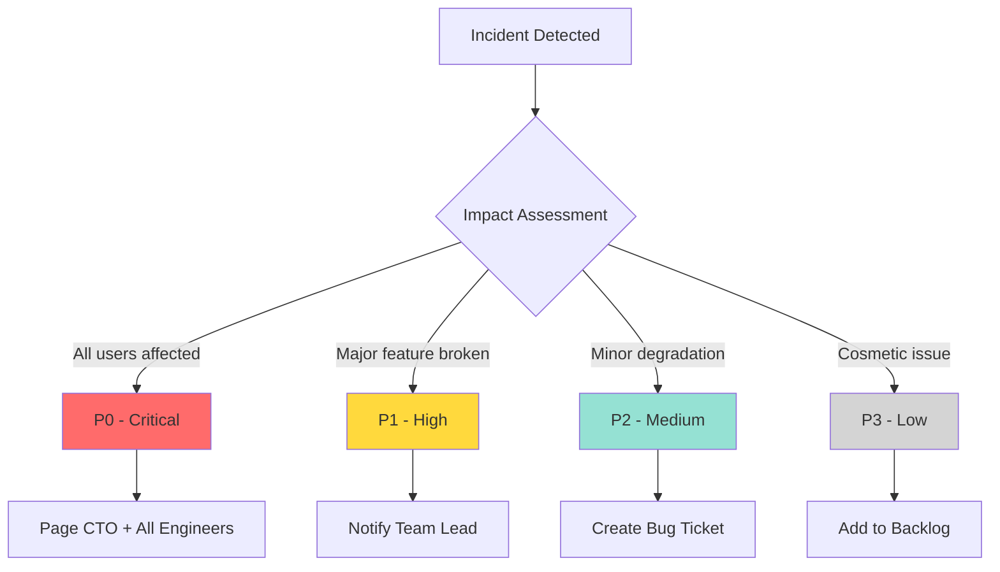
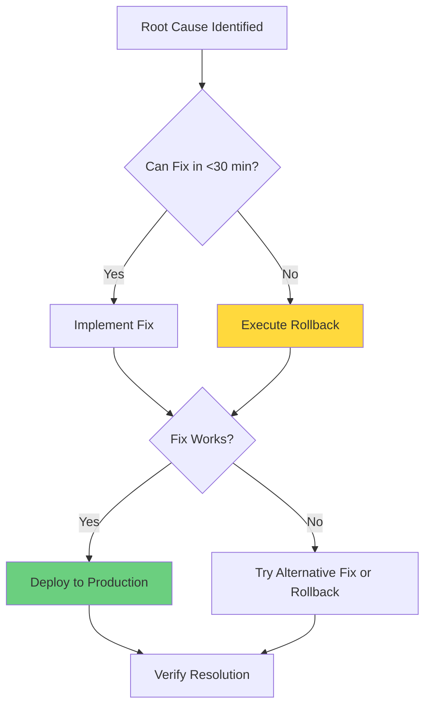
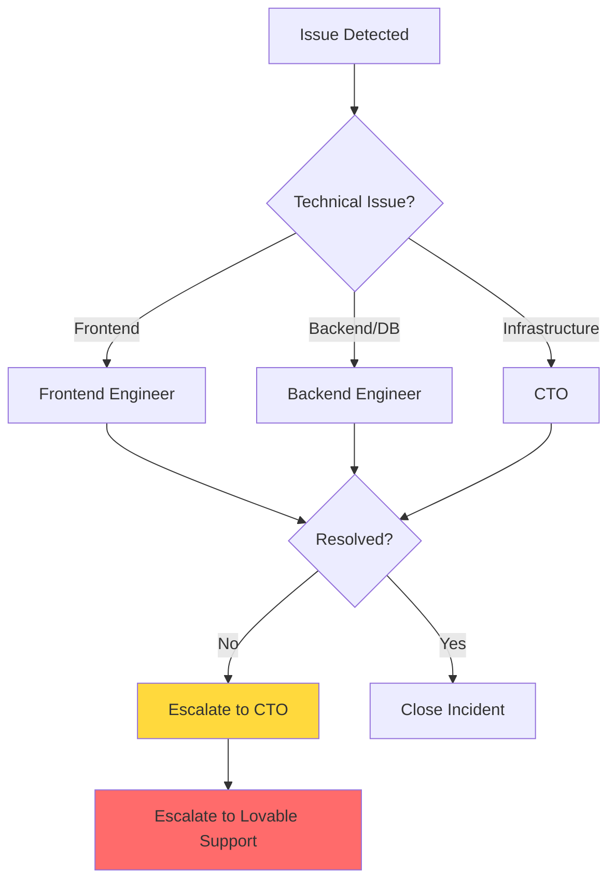

# Incident Response Plan

**Document Version:** 1.0  
**Last Updated:** February 28, 2026  
**Owner:** Engineering & Operations Team  
**Status:** Active

---

## Table of Contents

1. [Incident Severity Levels](#incident-severity-levels)
2. [Incident Response Workflow](#incident-response-workflow)
3. [Common Issues & Solutions](#common-issues--solutions)
4. [Escalation Paths](#escalation-paths)
5. [Communication Templates](#communication-templates)
6. [Post-Mortem Process](#post-mortem-process)
7. [On-Call Procedures (Future)](#on-call-procedures-future)

---

## Incident Severity Levels

### Severity Classification



### P0 - Critical (Resolve in <1 Hour)

**Definition:** Total service outage or data loss affecting all or most users.

**Examples:**
- Entire site down (500 errors, DNS failure)
- Database connection completely broken
- Authentication system failure (no one can log in)
- Data loss or corruption
- Security breach or vulnerability being actively exploited
- Payment processing completely broken

**Response:**
- **Immediate notification:** Page CTO + all available engineers (Slack + phone)
- **Response time:** <15 minutes
- **Resolution time:** <1 hour
- **Communication:** Update users via status page/social media every 30 minutes

**Actions:**
1. All hands on deck - drop everything else
2. Create war room (Slack channel or video call)
3. Assign incident commander (usually CTO or senior engineer)
4. Execute immediate fix or rollback
5. Post-mortem required within 24 hours

---

### P1 - High (Resolve in <4 Hours)

**Definition:** Major feature broken or significant degradation affecting many users.

**Examples:**
- Product analysis completely failing for all users
- OCR not processing any images
- Routine optimization returning errors for all users
- Edge function timeout for critical endpoint
- Database queries failing for specific table
- Major performance degradation (3x slowdown)
- Authentication issues affecting subset of users

**Response:**
- **Notification:** Notify engineering team lead + on-call engineer
- **Response time:** <1 hour
- **Resolution time:** <4 hours
- **Communication:** Update team in Slack every hour; notify users if user-facing

**Actions:**
1. Senior engineer takes lead
2. Investigate root cause via logs and monitoring
3. Implement fix or rollback if needed
4. Test fix in staging before production
5. Brief post-mortem within 48 hours

---

### P2 - Medium (Resolve in <1 Day)

**Definition:** Minor feature broken or degradation with workaround available.

**Examples:**
- Feedback widget submission failing
- Analytics dashboard not loading for admins
- Minor OCR accuracy regression
- Slow page load on non-critical page
- UI component rendering incorrectly
- Non-critical edge function errors

**Response:**
- **Notification:** Create bug ticket, notify team lead
- **Response time:** <4 hours
- **Resolution time:** <1 day (next business day)
- **Communication:** Internal Slack notification only

**Actions:**
1. Assign to engineer via bug ticket
2. Investigate and implement fix
3. Include in next regular deployment
4. No post-mortem required unless recurring

---

### P3 - Low (Resolve in <1 Week)

**Definition:** Cosmetic issues or edge cases with minimal user impact.

**Examples:**
- Typo in copy
- Minor styling issue
- Icon misalignment
- Rare edge case bug affecting <1% of users
- Non-critical analytics tracking gap
- Help text unclear

**Response:**
- **Notification:** Add to backlog
- **Response time:** Next sprint planning
- **Resolution time:** <1 week
- **Communication:** None required

**Actions:**
1. Add to product backlog
2. Prioritize in next sprint
3. Fix during regular development cycle

---

## Incident Response Workflow

### Detection

**How incidents are detected:**

1. **Automated Monitoring**
   - Lovable Cloud uptime monitoring
   - Edge function error rate alerts
   - Database connection failures
   - Performance degradation detection

2. **User Reports**
   - In-app feedback widget
   - Support email (support@skinlytix.com)
   - Social media mentions
   - Community Discord/Slack

3. **Team Discovery**
   - Engineers notice during development
   - QA finds during testing
   - Product team observes during usage

### Triage (First 5 Minutes)

**Incident Commander Checklist:**

1. **Confirm the Issue**
   - [ ] Reproduce the issue (if possible)
   - [ ] Check if issue is widespread or isolated
   - [ ] Determine user impact (how many users affected?)

2. **Classify Severity**
   - [ ] Assign P0/P1/P2/P3 level
   - [ ] Document impact assessment

3. **Assemble Response Team**
   - P0: All hands on deck
   - P1: Engineering lead + 2 engineers
   - P2: Single engineer
   - P3: Backlog

4. **Create Incident Channel**
   ```
   # Slack channel naming:
   #incident-YYYYMMDD-brief-description
   
   Example: #incident-20251111-site-down
   ```

### Investigation (First 15-30 Minutes)

**Debugging Steps:**

1. **Check Edge Function Logs**
   - Lovable Cloud → Functions → Select function → Logs
   - Look for error messages, stack traces
   - Check invocation success rate

2. **Check Database Logs**
   - Lovable Cloud → Database → Logs
   - Look for query errors, connection issues
   - Check for slow queries or timeouts

3. **Check Browser Console**
   - Open production site in incognito
   - Check DevTools Console (F12) for JavaScript errors
   - Check Network tab for failed API calls

4. **Review Recent Changes**
   - Check recent deployments (Lovable History)
   - Review recent PRs merged
   - Check if database migration recently ran

5. **Check Third-Party Services**
   - Lovable Cloud status: https://status.lovable.dev
   - Supabase status: https://status.supabase.com
   - OpenAI status: https://status.openai.com (if using)

**Investigation Template:**

```markdown
## Incident Investigation: [Brief Title]

**Detected at:** [Timestamp]
**Severity:** [P0/P1/P2/P3]
**Affected Users:** [All / Subset / Percentage]

### Symptoms
- [What users are experiencing]
- [Error messages shown]

### Timeline
- [HH:MM] - Issue first detected
- [HH:MM] - Investigation started
- [HH:MM] - Root cause identified
- [HH:MM] - Fix deployed
- [HH:MM] - Verified resolved

### Root Cause
[What caused the issue]

### Fix Applied
[What was done to resolve]

### Prevention
[How to prevent this in the future]
```

### Resolution

**Fix or Rollback Decision Tree:**



**Resolution Options:**

| Option | When to Use | Time | Risk |
|--------|-------------|------|------|
| **Quick Fix** | Root cause clear, fix simple | 15-30 min | Low |
| **Rollback** | Unclear root cause, no quick fix | 5-10 min | Low |
| **Workaround** | Fix complex, need time | 10-20 min | Medium |
| **Forward Fix** | Rollback not possible (DB migration) | 30-60 min | Medium |

### Verification (Post-Resolution)

**Confirm issue resolved:**

1. **Test Affected Feature**
   - [ ] Reproduce original issue → Should not occur
   - [ ] Test related functionality → Should work
   - [ ] Check error logs → No new errors

2. **Monitor for 30 Minutes**
   - [ ] Watch edge function logs
   - [ ] Check error rate returning to baseline
   - [ ] Monitor user activity resuming normally

3. **Get User Confirmation** (if applicable)
   - [ ] Contact user who reported issue
   - [ ] Verify issue resolved for them

### Communication

**During Incident:**

- **P0:** Update every 15-30 minutes
- **P1:** Update every 1 hour
- **P2/P3:** Initial acknowledgment only

**After Resolution:**

- **P0/P1:** Send resolution announcement
- **P2/P3:** Update bug ticket status

**Templates:** See [Communication Templates](#communication-templates) section

---

## Common Issues & Solutions

### 1. OCR Failures

**Symptom:** Tesseract.js worker crashes or returns empty results

**Common Causes:**
- Tesseract.js worker memory leak
- Image file too large (>10MB)
- Image format not supported
- Low memory on device

**Diagnosis:**
```javascript
// Check browser console for:
"Failed to load worker"
"Out of memory"
"Image decode failed"
```

**Solutions:**

```typescript
// Solution 1: Restart Tesseract worker
await worker.terminate();
const worker = await createWorker('eng');

// Solution 2: Compress image before processing
const compressedImage = await compressImage(file, 0.8); // 80% quality

// Solution 3: Increase memory allocation (edge function)
// In supabase/config.toml:
[functions.extract-ingredients]
memory = 512  # Increase from default 256MB
```

**Prevention:**
- Validate image size before OCR (<5MB)
- Implement retry logic with exponential backoff
- Add worker health check

---

### 2. Slow AI Analysis

**Symptom:** Lovable AI timeout or takes >60 seconds

**Common Causes:**
- Rate limit exceeded (429 error)
- AI credits depleted (402 error)
- Large prompt exceeding token limit
- Network latency

**Diagnosis:**
```typescript
// Check edge function logs for:
"429 Too Many Requests"
"402 Payment Required"
"Request timeout after 60s"
```

**Solutions:**

```typescript
// Solution 1: Handle rate limiting gracefully
if (response.status === 429) {
  const retryAfter = response.headers.get('Retry-After') || 60;
  return { error: `Rate limited. Retry in ${retryAfter}s` };
}

// Solution 2: Check AI credits
if (response.status === 402) {
  return { error: 'AI credits depleted. Contact support@skinlytix.com' };
}

// Solution 3: Reduce prompt size
const optimizedPrompt = `Analyze only top 10 ingredients: ${ingredients.slice(0, 10)}`;
```

**Prevention:**
- Implement request queuing for high traffic
- Monitor AI credit balance (Lovable dashboard)
- Optimize prompts to reduce token usage
- Add user-facing retry button

---

### 3. Database Connection Issues

**Symptom:** Connection pool exhausted or query timeouts

**Common Causes:**
- Too many concurrent connections
- Long-running queries
- Database CPU/memory overload
- N+1 query problem

**Diagnosis:**
```sql
-- Check active connections (Lovable Cloud SQL Editor)
SELECT count(*) FROM pg_stat_activity;

-- Check long-running queries
SELECT pid, now() - query_start AS duration, query
FROM pg_stat_activity
WHERE state = 'active'
ORDER BY duration DESC;
```

**Solutions:**

```typescript
// Solution 1: Optimize query with select specific columns
const { data } = await supabase
  .from('user_analyses')
  .select('id, epiq_score, product_name') // Instead of select('*')
  .eq('user_id', userId);

// Solution 2: Add pagination
const { data } = await supabase
  .from('user_analyses')
  .select('*')
  .range(0, 19) // First 20 results
  .order('analyzed_at', { ascending: false });

// Solution 3: Use React Query caching
const { data } = useQuery({
  queryKey: ['analyses', userId],
  queryFn: fetchAnalyses,
  staleTime: 5 * 60 * 1000, // Cache for 5 minutes
});
```

**Prevention:**
- Add database indexes on frequently queried columns
- Implement pagination for large datasets
- Use React Query caching to reduce redundant queries
- Upgrade database instance size (Lovable Cloud → Advanced Settings)

---

### 4. Authentication Errors

**Symptom:** JWT expiry, users logged out unexpectedly

**Common Causes:**
- JWT token expired (1 hour default)
- Token refresh failed
- Session cookie cleared
- Auth service disruption

**Diagnosis:**
```typescript
// Check browser console for:
"JWT expired"
"Invalid JWT"
"Failed to refresh token"

// Check localStorage:
localStorage.getItem('supabase.auth.token')
```

**Solutions:**

```typescript
// Solution 1: Implement token refresh
supabase.auth.onAuthStateChange((event, session) => {
  if (event === 'TOKEN_REFRESHED') {
    console.log('Token refreshed successfully');
  }
  if (event === 'SIGNED_OUT') {
    // Redirect to login
    window.location.href = '/auth';
  }
});

// Solution 2: Handle auth errors gracefully
const { data, error } = await supabase.auth.getUser();
if (error) {
  // Redirect to login
  toast({ title: 'Session expired', description: 'Please log in again' });
  navigate('/auth');
}
```

**Prevention:**
- Enable auto token refresh (enabled by default in Supabase client)
- Add auth error boundaries
- Display clear error messages to users

---

### 5. Analytics Views Security Warnings

**Symptom:** RLS warnings on analytics views, unauthorized access concerns

**Common Causes:**
- Views don't inherit RLS from underlying tables
- Missing admin validation in frontend hooks
- Direct view access without auth check

**Diagnosis:**
```sql
-- Check if RLS enabled on views
SELECT schemaname, tablename, rowsecurity
FROM pg_tables
WHERE schemaname = 'public';
-- Note: Views show as rowsecurity = false (expected)
```

**Solutions:**

```typescript
// Solution 1: Add admin check in frontend hooks (ALREADY IMPLEMENTED)
const { data: { user } } = await supabase.auth.getUser();
if (!user) throw new Error('Not authenticated');

const { data: roles } = await supabase
  .from('user_roles')
  .select('role')
  .eq('user_id', user.id)
  .eq('role', 'admin')
  .maybeSingle();

if (!roles) throw new Error('Unauthorized: Admin access required');

// Solution 2: Use ProtectedRoute for /analytics page (ALREADY IMPLEMENTED)
<ProtectedRoute>
  <Analytics />
</ProtectedRoute>

// Solution 3: Revoke public access, grant to authenticated only
REVOKE ALL ON cta_performance_metrics FROM PUBLIC;
GRANT SELECT ON cta_performance_metrics TO authenticated;
```

**Prevention:**
- Always use multi-layered security (RLS + frontend checks + route protection)
- Never rely on client-side security alone
- Document security model in code comments

---

## Escalation Paths

### Escalation Matrix



### L1: Frontend Issues

**Handles:**
- UI rendering bugs
- React component errors
- CSS/styling issues
- Client-side routing problems
- Form validation issues

**Contact:**
- Slack: #frontend channel
- Assignee: Frontend Engineer

**Escalate to L2 if:**
- Issue is actually backend/API related
- Requires database changes
- Unresolved after 2 hours (P1) or 1 day (P2)

---

### L2: Backend/Database Issues

**Handles:**
- Edge function errors
- Database query problems
- API integration failures
- Authentication/authorization issues
- Data integrity problems

**Contact:**
- Slack: #backend channel
- Assignee: Backend Engineer

**Escalate to L3 if:**
- Lovable Cloud infrastructure issue suspected
- Requires infrastructure changes
- Unresolved after 1 hour (P0) or 4 hours (P1)

---

### L3: Infrastructure/Lovable Cloud

**Handles:**
- Supabase service outages
- Deployment pipeline failures
- DNS/networking issues
- Database instance problems
- CDN issues

**Contact:**
- Slack: @CTO (direct message)
- Email: cto@skinlytix.com

**Escalate to L4 if:**
- Issue is Lovable Cloud platform bug
- Requires Lovable support intervention

---

### L4: Lovable Cloud Support

**Handles:**
- Platform bugs
- Infrastructure failures
- Service degradation
- Database restore requests
- Feature requests

**Contact:**
- Email: support@lovable.dev
- Slack: Lovable Discord community
- Priority: Tag message with `@support` in Discord

**Include in Report:**
- Project ID: `yflbjaetupvakadqjhfb`
- Detailed description of issue
- Steps to reproduce
- Logs/screenshots
- Impact assessment (users affected)

---

## Communication Templates

### Internal: Incident Alert (Slack)

**For P0/P1 Incidents:**

```markdown
🚨 **INCIDENT ALERT - P[0/1]**

**Issue:** [Brief description]
**Detected:** [Timestamp]
**Impact:** [Number of users affected / Functionality broken]
**Status:** Investigating

**War Room:** #incident-YYYYMMDD-description

**Actions Needed:**
- [ ] @engineer1 - Check edge function logs
- [ ] @engineer2 - Review recent deployments
- [ ] @cto - Standby for escalation

**Updates:** Will post every [15/30/60] minutes
```

### Internal: Incident Update (Slack)

**During Investigation:**

```markdown
⚠️ **INCIDENT UPDATE - [HH:MM]**

**Status:** [Investigating / Root cause identified / Fix in progress]

**Progress:**
- ✅ Checked edge function logs - Found error in analyze-product
- ✅ Identified root cause - AI API rate limit exceeded
- 🔄 Implementing fix - Add retry logic with exponential backoff

**Next Steps:**
- Deploy fix to staging in 10 minutes
- Test and verify
- Deploy to production

**Next Update:** [+30 minutes]
```

### Internal: Incident Resolved (Slack)

```markdown
✅ **INCIDENT RESOLVED**

**Issue:** [Description]
**Root Cause:** [Explanation]
**Resolution:** [What was done]

**Timeline:**
- [HH:MM] Detected
- [HH:MM] Root cause identified
- [HH:MM] Fix deployed
- [HH:MM] Verified resolved

**Total Duration:** [X minutes/hours]

**Prevention:**
- [Action 1]
- [Action 2]

**Post-Mortem:** Will be published in #incidents within 24 hours
```

---

### External: User Communication

**Status Page Update (P0 Incidents):**

```markdown
🔴 **Service Disruption - Investigating**

We're currently experiencing issues with [feature/service].

**Impact:** [Description of what users are experiencing]
**Status:** Our team is actively investigating and working on a resolution.
**Workaround:** [If available]

**Updates:** We'll update this page every 30 minutes.

Last updated: [Timestamp]
```

**Status Page Resolution:**

```markdown
✅ **Issue Resolved**

The issue with [feature/service] has been resolved.

**Summary:** [Brief explanation]
**Duration:** [Start time - End time]

We apologize for the inconvenience. If you continue to experience issues, please contact support@skinlytix.com.

Thank you for your patience.
```

**Email to Affected Users (if applicable):**

```markdown
Subject: Service Disruption - Resolved

Hi [User],

We wanted to inform you that we recently experienced a temporary service disruption affecting [feature].

**What happened:** [Brief explanation]
**Impact to you:** [What they experienced]
**Resolution:** [What we did to fix it]

The issue has been fully resolved as of [timestamp].

We apologize for any inconvenience this may have caused. If you have any questions or concerns, please don't hesitate to reach out to our support team at support@skinlytix.com.

Thank you for your patience and understanding.

Best,
The SkinLytix Team
```

---

## Post-Mortem Process

### When Post-Mortem Required

**Mandatory for:**
- All P0 incidents
- All P1 incidents
- Any incident with user data impact
- Recurring issues (3+ times)

**Optional for:**
- P2 incidents with interesting learnings
- Near-miss incidents (almost became P0/P1)

### Post-Mortem Template

```markdown
# Incident Post-Mortem: [Brief Title]

**Date:** [YYYY-MM-DD]
**Severity:** [P0/P1/P2]
**Duration:** [Start - End time]
**Author:** [Name]

---

## Executive Summary

[1-2 paragraph summary of what happened, impact, and resolution]

---

## Timeline

| Time | Event |
|------|-------|
| HH:MM | Issue first detected [by monitoring/user report] |
| HH:MM | Investigation started |
| HH:MM | Root cause identified |
| HH:MM | Fix implemented |
| HH:MM | Fix deployed to production |
| HH:MM | Verified resolved |
| HH:MM | Incident closed |

**Total Duration:** [X minutes/hours]

---

## Impact Assessment

**Users Affected:** [Number or percentage]
**Functionality Impacted:** [List affected features]
**Revenue Impact:** [If applicable]
**Data Impact:** [Any data loss/corruption]

---

## Root Cause Analysis

### What Happened

[Detailed technical explanation of what went wrong]

### Why It Happened

[Underlying reasons - code bug, config error, infrastructure issue, etc.]

### Why It Wasn't Caught Earlier

[Gaps in testing, monitoring, or review process]

---

## Resolution

### Immediate Fix

[What was done to resolve the incident]

```code
[Code snippet or config change if applicable]
```

### Verification

[How we confirmed the issue was resolved]

---

## Lessons Learned

### What Went Well

- [Thing 1]
- [Thing 2]

### What Didn't Go Well

- [Thing 1]
- [Thing 2]

### Where We Got Lucky

- [Things that prevented worse outcome]

---

## Action Items

### Immediate (Complete within 1 week)

- [ ] [Action 1] - Assignee: [Name] - Due: [Date]
- [ ] [Action 2] - Assignee: [Name] - Due: [Date]

### Short-term (Complete within 1 month)

- [ ] [Action 3] - Assignee: [Name] - Due: [Date]

### Long-term (Complete within 3 months)

- [ ] [Action 4] - Assignee: [Name] - Due: [Date]

---

## Prevention

To prevent this incident from happening again:

1. **Monitoring:** [Add new alerts or improve existing monitoring]
2. **Testing:** [Add tests to catch this in the future]
3. **Process:** [Update deployment or review process]
4. **Documentation:** [Update runbooks or SOPs]

---

## Related Incidents

- [Link to similar past incidents, if any]

---

**Post-Mortem Review:**
- [ ] Reviewed by engineering team
- [ ] Reviewed by CTO
- [ ] Action items created in bug tracker
- [ ] Shared with relevant stakeholders
```

### Post-Mortem Distribution

1. **Draft Post-Mortem** - Incident commander writes within 24 hours
2. **Team Review** - Engineering team reviews and adds input
3. **Final Review** - CTO approves
4. **Distribution** - Share in #incidents Slack channel
5. **Follow-Up** - Track action items to completion

---

## On-Call Procedures (Future)

**Status:** Not yet implemented  
**Planned for:** Month 6+ (once team grows)

### Future On-Call Rotation

**Rotation Schedule:**
- 1 week rotations
- 2 engineers in rotation (primary + backup)
- Off-hours coverage: 6 PM - 9 AM weekdays, 24/7 weekends

**On-Call Responsibilities:**
- Monitor incident alerts
- Respond to P0/P1 incidents within SLA
- Escalate to CTO if needed
- Document all incidents

**On-Call Compensation:**
- On-call stipend: $XXX per week
- Incident response: Overtime pay or comp time

**Tools (Future):**
- PagerDuty or similar for alerting
- Runbook automation
- Mobile app for incident management

---

## Document Version History

| Version | Date | Author | Changes |
|---------|------|--------|---------|
| 1.0 | Nov 11, 2025 | Engineering Team | Initial comprehensive incident response guide |

---

**For Questions or Updates:**  
Contact: CTO or Engineering Lead  
Slack Channel: #incidents

**Related Documentation:**
- [Deployment Runbook](./Deployment-Runbook.md)
- [Engineering SOPs](../technical/Engineering-SOPs.md)
- [Monitoring Guide](../technical/Monitoring-Guide.md) (future)

---

**End of Incident Response Guide**
