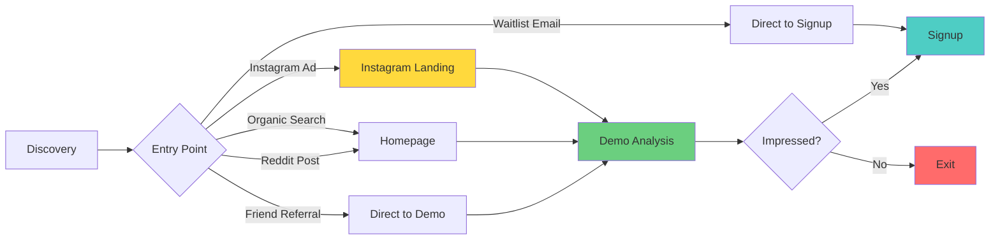
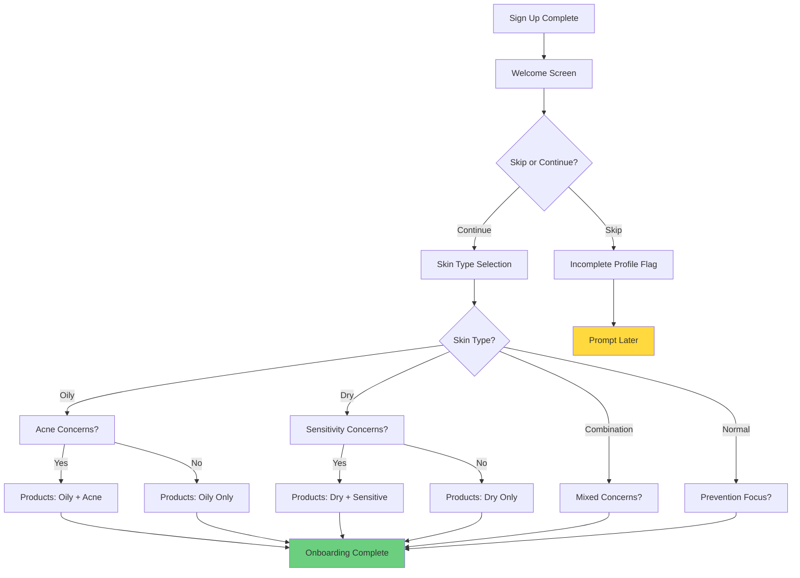
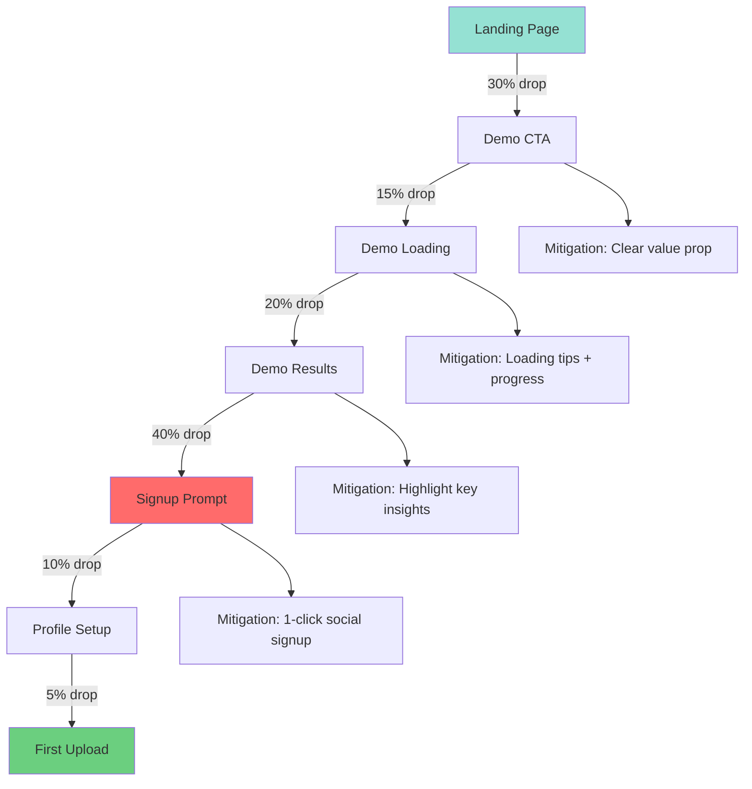
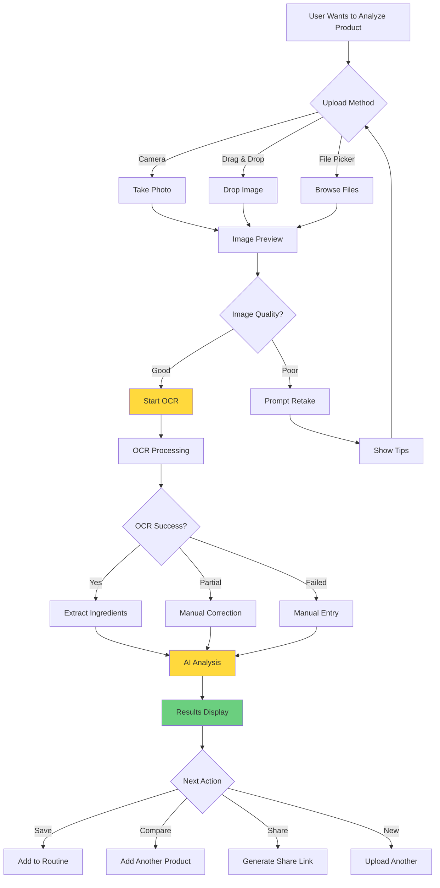
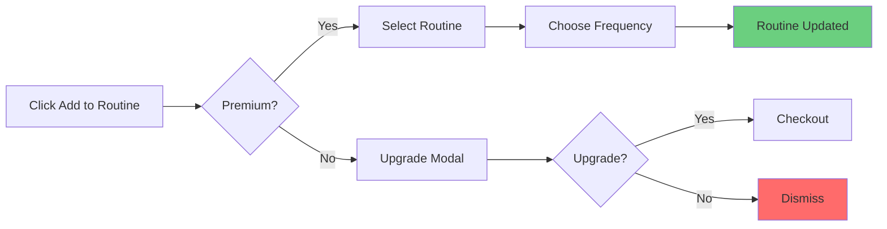
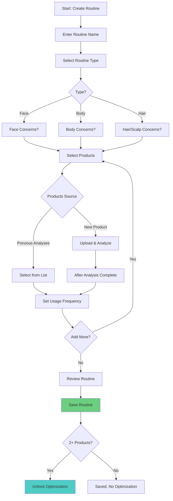
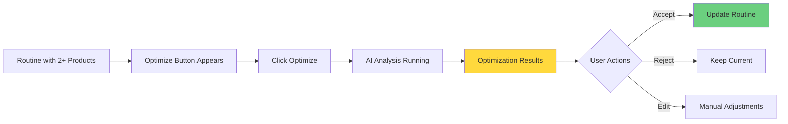
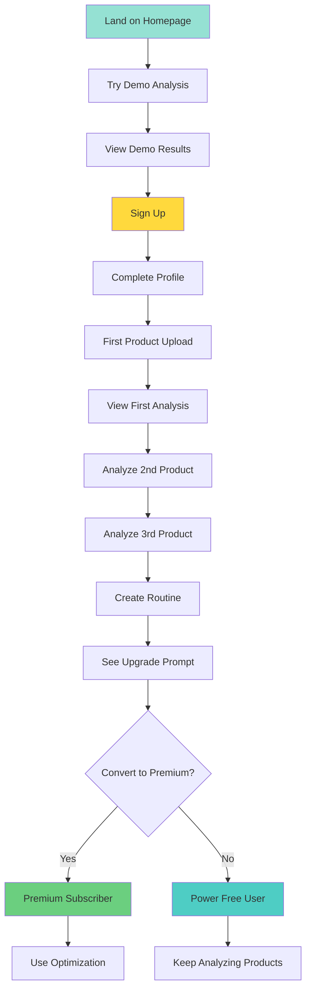
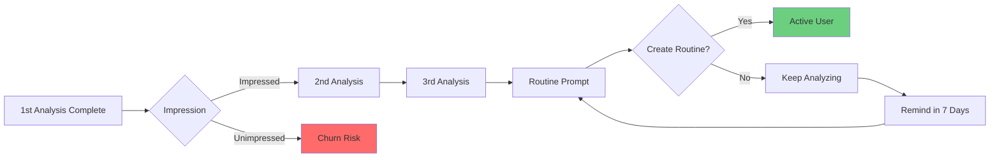
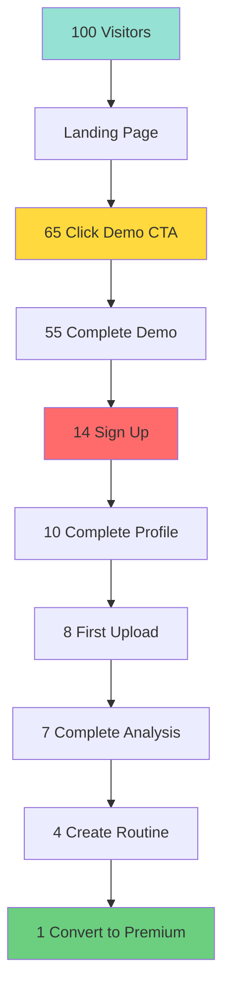

# User Flows & Journey Maps

**Document Version:** 1.0  
**Last Updated:** November 11, 2025  
**Owner:** Product Team  
**Status:** Active

---

## Table of Contents

1. [User Personas](#user-personas)
2. [Onboarding Flow](#onboarding-flow)
3. [Product Analysis Flow](#product-analysis-flow)
4. [Routine Building Flow](#routine-building-flow)
5. [Conversion Funnels](#conversion-funnels)
6. [Drop-off Points & Mitigation](#drop-off-points--mitigation)
7. [A/B Testing Opportunities](#ab-testing-opportunities)

---

## User Personas

### Primary Personas

#### 1. Emma - The Skincare Enthusiast (24, Student)

**Demographics:**
- Age: 24
- Location: Los Angeles, CA
- Occupation: Graduate student
- Income: $20k/year (part-time + student loans)

**Behaviors:**
- Spends 30+ min daily on skincare routine
- Active on r/SkincareAddiction, TikTok #SkincareTok
- Reads ingredient lists but doesn't fully understand them
- Owns 15+ skincare products
- Budget-conscious but willing to invest in "good" products

**Pain Points:**
- "I don't know if this product is actually good for my skin"
- "I see conflicting information online about ingredients"
- "I've wasted money on products that broke me out"
- "My routine is getting too expensive"

**Goals:**
- Understand what's really in her products
- Build an evidence-based routine
- Avoid ingredients that cause breakouts
- Save money without sacrificing quality

**How SkinLytix Helps:**
- Instant ingredient analysis → Confidence in purchases
- EpiQ Score → Simple quality metric
- Routine optimization → Cost savings
- Personalized to her skin type (oily, acne-prone)

---

#### 2. Michael - The Concerned Consumer (35, Marketing Manager)

**Demographics:**
- Age: 35
- Location: Austin, TX
- Occupation: Marketing Manager
- Income: $85k/year
- Family: Married, 1 child

**Behaviors:**
- Basic skincare routine (cleanser, moisturizer, sunscreen)
- Prefers "clean" and "natural" products
- Reads product reviews before buying
- Shops at Target, Whole Foods
- Uses products for 3-6 months before switching

**Pain Points:**
- "I don't have time to research every ingredient"
- "Is this product really 'clean' or just marketing?"
- "My wife has sensitive skin - what's safe?"
- "I want effective products without harmful chemicals"

**Goals:**
- Quick, trustworthy product recommendations
- Avoid harmful or questionable ingredients
- Find products safe for whole family
- Make informed decisions without deep research

**How SkinLytix Helps:**
- 30-second analysis → Fast decision-making
- Red flag highlighting → Safety confidence
- Evidence-based claims → Cut through greenwashing
- Family-friendly recommendations

---

#### 3. Dr. Sarah Chen - The Professional Esthetician (42)

**Demographics:**
- Age: 42
- Location: San Francisco, CA
- Occupation: Licensed Esthetician (own practice)
- Income: $120k/year
- Clients: 40-50 active clients

**Behaviors:**
- Recommends specific products to clients
- Stays current on cosmetic chemistry research
- Attends industry conferences
- Values science-backed recommendations
- Needs to justify product recommendations to clients

**Pain Points:**
- "Clients ask about ingredients I don't have time to research"
- "I need to back up my recommendations with data"
- "Clients bring in products from TikTok I've never heard of"
- "I want to build client trust with transparency"

**Goals:**
- Quick ingredient lookups during consultations
- Evidence to support product recommendations
- Help clients understand their routine
- Professional credibility

**How SkinLytix Helps:**
- Professional-grade analysis → Client education tool
- Scientific explanations → Build trust
- Routine optimization → Value-added service
- API access (future) → Practice management integration

---

## Onboarding Flow

### Entry Points



### Decision Trees Based on Skin Concerns

**New User → Profile Setup:**



### Psychological Motivators at Each Step

**Step 1: Landing Page**

**User State:** Curious, skeptical  
**Motivation:** "Is this actually useful?"  
**Strategy:** Immediate value demonstration

```
Psychological Triggers:
✓ Social proof ("Join 10,000+ skincare enthusiasts")
✓ Zero friction ("No sign-up required")
✓ Instant gratification ("See results in 30 seconds")
✓ Curiosity gap ("What's really in your moisturizer?")
```

**Step 2: Demo Analysis**

**User State:** Engaged, evaluating  
**Motivation:** "This is actually helpful"  
**Strategy:** Show comprehensive value, create FOMO

```
Psychological Triggers:
✓ Personalization ("Based on your oily skin...")
✓ Expertise ("We analyzed 847 scientific studies...")
✓ Scarcity ("Sign up to save this analysis")
✓ Authority ("Trusted by dermatologists")
```

**Step 3: Signup Prompt**

**User State:** Interested but cautious  
**Motivation:** "Is it worth creating an account?"  
**Strategy:** Emphasize ease and benefits

```
Psychological Triggers:
✓ Ease ("Sign up with Google - 10 seconds")
✓ Security ("We never share your data")
✓ Benefits ("Track your routine, save analyses")
✓ Loss aversion ("Don't lose this analysis!")
```

**Step 4: Profile Setup**

**User State:** Committed but impatient  
**Motivation:** "Get me to the value quickly"  
**Strategy:** Quick, optional, rewarding

```
Psychological Triggers:
✓ Progress bar ("2 of 3 steps")
✓ Skip option ("Do this later")
✓ Reward ("Get personalized recommendations")
✓ Social proof ("90% of users complete this")
```

**Step 5: First Upload**

**User State:** Ready to use product  
**Motivation:** "Let me analyze MY products"  
**Strategy:** Make first success easy

```
Psychological Triggers:
✓ Achievement ("Your first analysis!")
✓ Discovery ("Wow, I didn't know that...")
✓ Empowerment ("Make informed decisions")
✓ Next action ("Add to routine?")
```

### Drop-off Risk Points with Mitigation



**Risk Point 1: Demo CTA Click (30% don't click)**

**Why:** Not convinced of value, overwhelmed by options

**Mitigation:**
- A/B test CTA copy ("Try Demo" vs "Analyze Your Product Free")
- Add video demonstration (15-second product)
- Reduce cognitive load (single primary CTA, remove distractions)
- Add trust signals (testimonials, media logos)

**Risk Point 2: Demo Loading (15% abandon during wait)**

**Why:** Loading takes 20-30 seconds, user loses interest

**Mitigation:**
- Loading tips carousel (educate during wait)
- Progress indicator (show % complete)
- Pre-render demo content (reduce perceived wait time)
- Add "Did you know?" facts about ingredients

**Risk Point 3: Demo Results (20% leave after viewing)**

**Why:** Got their answer, don't see value in account

**Mitigation:**
- Highlight unavailable features (grayed out "Add to Routine" button)
- Show "Sign up to unlock" overlays
- Add comparison CTA ("Compare with another product →")
- Exit-intent popup ("Wait! Save this analysis")

**Risk Point 4: Signup Prompt (40% don't convert)**

**Why:** Signup friction, unclear value, privacy concerns

**Mitigation:**
- One-click Google/Apple signup (reduce friction)
- Clear benefits list ("Track routine, get recommendations, save analyses")
- Privacy badge ("We never sell your data")
- Guest mode option ("Continue without account" - track via localStorage)

---

## Product Analysis Flow

### Upload Methods & User Paths



### OCR Processing States

**State 1: Image Upload**

```
User sees:
┌─────────────────────────────┐
│  📷 Upload Product Image     │
│                             │
│  [Drag & Drop Area]         │
│  or click to browse         │
│                             │
│  💡 Tips for best results:  │
│  • Good lighting            │
│  • Flat surface             │
│  • Clear focus              │
└─────────────────────────────┘
```

**State 2: Image Preview**

```
User sees:
┌─────────────────────────────┐
│  ✓ Image uploaded           │
│  [Thumbnail Preview]        │
│                             │
│  ✓ Ingredient list detected │
│                             │
│  [Analyze Product] [Retake] │
└─────────────────────────────┘
```

**State 3: OCR Processing (20-30 seconds)**

```
User sees:
┌─────────────────────────────┐
│  🔍 Analyzing ingredients... │
│  [Progress: 45%]            │
│                             │
│  💡 Did you know?           │
│  Niacinamide can reduce     │
│  hyperpigmentation by 35%   │
│                             │
│  [rotating tips carousel]   │
└─────────────────────────────┘
```

**State 4: AI Analysis (25-40 seconds)**

```
User sees:
┌─────────────────────────────┐
│  🧠 Generating insights...  │
│  [Progress: 70%]            │
│                             │
│  Analyzing 24 ingredients   │
│  against your oily skin...  │
│                             │
│  [animated progress]        │
└─────────────────────────────┘
```

**State 5: Results Display**

```
User sees:
┌─────────────────────────────┐
│  ✨ Analysis Complete!       │
│                             │
│  EpiQ Score: 82/100 🌟      │
│  Good choice for oily skin  │
│                             │
│  [View Full Report ↓]       │
│                             │
│  [Add to Routine] [Share]   │
└─────────────────────────────┘
```

### Analysis Results Interpretation

**Results Page Structure:**

```
┌─────────────────────────────────────┐
│ [← Back]  CeraVe Moisturizing Cream │
├─────────────────────────────────────┤
│                                     │
│         EpiQ Score: 82/100          │
│         ⭐⭐⭐⭐☆                     │
│                                     │
│  "Great choice for dry skin.        │
│   Evidence-backed formula."         │
│                                     │
├─────────────────────────────────────┤
│ 🎯 KEY ACTIVES                      │
│  • Ceramides (Barrier repair)      │
│  • Hyaluronic Acid (Hydration)     │
│  • Glycerin (Humectant)            │
├─────────────────────────────────────┤
│ ⚠️ RED FLAGS                        │
│  None detected ✓                    │
├─────────────────────────────────────┤
│ 👤 FOR YOUR SKIN                    │
│  ✓ Suitable for dry skin           │
│  ✓ Hydrating, non-comedogenic      │
│  ⚠ May be heavy for oily skin      │
├─────────────────────────────────────┤
│ 💡 RECOMMENDATIONS                  │
│  • Use AM & PM after cleansing     │
│  • Pair with SPF in morning        │
│  • Consider adding retinol PM      │
├─────────────────────────────────────┤
│ [Add to Routine] [Compare Product]  │
│ [Share Analysis] [Analyze Another]  │
└─────────────────────────────────────┘
```

### Post-Analysis CTAs

**Primary CTA: Add to Routine (Premium)**



**Secondary CTA: Analyze Another**

Immediately returns to upload page, maintains engagement momentum.

**Tertiary CTA: Share Analysis**

```typescript
// Generate shareable link
const shareUrl = `${baseUrl}/shared/${analysisId}`;

// Share options:
// 1. Native share (mobile)
if (navigator.share) {
  await navigator.share({
    title: `${productName} Analysis`,
    text: `Check out the SkinLytix analysis for ${productName}`,
    url: shareUrl
  });
}

// 2. Copy link
navigator.clipboard.writeText(shareUrl);

// 3. Social media (future)
// - Instagram Story sticker
// - Twitter card
// - Pinterest pin
```

---

## Routine Building Flow

### Routine Creation Triggers

**Trigger 1: Post-Analysis CTA**

```
User just analyzed a product
↓
"Add to Routine" button appears
↓
If no routine exists → "Create Your First Routine"
If routine exists → "Add to [Routine Name]"
```

**Trigger 2: Navigation Menu**

```
User clicks "Routines" in nav
↓
If no routines → Empty state with CTA
If routines exist → Routine list with "New Routine" button
```

**Trigger 3: Profile Prompt**

```
User completed 3+ analyses
↓
Banner appears: "Build a routine from your analyses"
↓
Click → Pre-filled routine with analyzed products
```

### Routine Building Steps



### Product Addition Methods

**Method 1: From Analysis History**

```
┌─────────────────────────────┐
│ Add Products to Routine     │
├─────────────────────────────┤
│ ✓ CeraVe Cleanser          │
│   Analyzed 2 days ago       │
│   [Add]                     │
│                             │
│ ✓ The Ordinary Niacinamide │
│   Analyzed 1 week ago       │
│   [Add]                     │
│                             │
│ □ La Roche-Posay Sunscreen │
│   Analyzed 3 weeks ago      │
│   [Add]                     │
│                             │
│ [+ Analyze New Product]     │
└─────────────────────────────┘
```

**Method 2: Quick Add (Upload → Auto-Add)**

```
User in routine builder
↓
Clicks "+ Add Product"
↓
Upload image
↓
Analysis runs
↓
Automatically added to routine (frequency prompt)
↓
Returns to routine builder
```

**Method 3: Bulk Import (Future)**

```
Upload multiple product photos
↓
Batch OCR processing
↓
Batch AI analysis
↓
Review all analyses
↓
Select which to add to routine
```

### Optimization Unlock Criteria

**Requirements:**
- ✅ Routine has 2+ products
- ✅ Premium subscription active
- ✅ Products have compatible categories

**Optimization Flow:**



### Cost Savings Reveal

**Optimization Results Screen:**

```
┌───────────────────────────────────────┐
│ 💰 Routine Optimization Complete!     │
├───────────────────────────────────────┤
│                                       │
│  Current Monthly Cost: $127           │
│  Optimized Cost: $89                  │
│  Savings: $38/month ($456/year)       │
│                                       │
├───────────────────────────────────────┤
│ 🔍 INSIGHTS                           │
│                                       │
│ • 2 products are redundant            │
│   (both have 5% Niacinamide)         │
│                                       │
│ • Better alternative found:           │
│   CeraVe PM → The Ordinary ($8 less) │
│                                       │
│ • Routine order optimized:            │
│   pH-dependent actives separated     │
│                                       │
├───────────────────────────────────────┤
│ [Apply Changes] [Keep Current Routine]│
└───────────────────────────────────────┘
```

---

## Conversion Funnels

### Free → Power User Journey



**Conversion Metrics:**

| Stage | Target Conversion | Current (Estimated) |
|-------|-------------------|---------------------|
| Homepage → Demo | 40% | To be measured |
| Demo → Sign Up | 25% | To be measured |
| Sign Up → Profile Complete | 70% | To be measured |
| Profile → First Analysis | 85% | To be measured |
| 1 Analysis → 3 Analyses | 60% | To be measured |
| 3 Analyses → Routine | 45% | To be measured |
| Routine → Premium | 15% | To be measured |

### Demo User → Signup Conversion

**Conversion Window: First 10 Minutes**

```
0:00 - User lands on homepage
0:30 - Clicks "Try Demo Analysis"
1:00 - Demo loads (auto-analyzes featured product)
1:30 - Views results, scrolls through insights
2:00 - Sees "Sign up to save results" CTA

Decision point: Does user sign up?

If YES (25%):
├─ 2:30 - Clicks signup, uses Google auth
├─ 3:00 - Redirected to onboarding
├─ 4:00 - Completes profile setup
├─ 5:00 - First product upload prompt
└─ 10:00 - Completed first own analysis

If NO (75%):
├─ Sees exit-intent popup (5% convert)
├─ Browses more demo features (10% convert later)
└─ Leaves site (65% lost)
```

**Optimization Strategies:**

1. **Reduce Time to Value**
   - Load demo instantly (pre-cache featured product)
   - Show best insights first (personalized if possible)
   - Clear "What's next?" CTA

2. **Increase Signup Appeal**
   - Show what they'll unlock (grayed out features)
   - One-click social signup (remove friction)
   - Clear privacy messaging ("We never spam")

3. **Recover Exits**
   - Exit-intent popup with special offer
   - Email capture for waitlist
   - Retargeting ads (Instagram, Google)

### First Analysis → Routine Builder

**Activation Funnel:**



**Key Insight:** Users who create a routine have 3x higher retention than those who just analyze products.

**Activation Strategy:**
- Prompt routine creation after 3 analyses
- Pre-fill routine with analyzed products
- Show value: "Track your routine cost: $X/month"
- Gamification: "2 more analyses to unlock optimization"

### Routine → Optimization Conversion

**Premium Unlock Point:**

```
User with 2+ product routine
↓
"Optimize Routine" button appears (grayed out)
↓
Click → Upgrade modal
↓
"See how to save $456/year + get better results"
↓
[Start Free Trial] [View Plans]
```

**Conversion Tactics:**

1. **Value Demonstration**
   - Show potential savings (calculated from product prices)
   - Preview optimization insights (blur details)
   - Testimonial: "I saved $40/month!" - Emma, 24

2. **Risk Reversal**
   - 7-day free trial
   - Cancel anytime
   - Money-back guarantee

3. **Urgency (Optional)**
   - "First month 50% off (limited time)"
   - "Join 1,000+ optimized routines"

---

## Drop-off Points & Mitigation

### Critical Drop-off Analysis



**Drop-off Rates:**

| Step | Drop-off | Severity | Mitigation Priority |
|------|----------|----------|---------------------|
| Landing → Demo CTA | 35% | Medium | P2 |
| Demo CTA → Complete | 15% | Medium | P2 |
| Demo → Sign Up | 75% | **Critical** | **P0** |
| Sign Up → Profile | 29% | Low | P3 |
| Profile → Upload | 20% | Low | P3 |
| Upload → Complete | 13% | Low | P3 |
| Analysis → Routine | 43% | High | P1 |
| Routine → Premium | 75% | High | P1 |

### P0 Mitigation: Demo → Sign Up (75% drop)

**Problem:** Most users view demo and leave without signing up.

**Hypothesis:** Signup friction + unclear value proposition

**Solutions:**

1. **Reduce Friction**
   ```
   ❌ Before: Email + password + confirm password
   ✅ After: One-click Google/Apple signin
   
   Result: Expected 10-15% conversion increase
   ```

2. **Increase Value Perception**
   ```
   ❌ Before: Generic "Sign up to save results"
   ✅ After: "Save this analysis + track your routine forever"
   
   Add visual: Grayed out "Add to Routine" button
   "Sign up to unlock →"
   ```

3. **Exit Intent Recovery**
   ```
   User moves to close tab
   ↓
   Popup appears:
   "Wait! Don't lose this analysis 🧴"
   [Email me the results] [Create free account]
   
   Even email capture is valuable for retargeting
   ```

4. **Guest Mode (Alternative)**
   ```
   "Continue without account"
   ↓
   Save analysis to localStorage
   ↓
   Prompt signup after 2nd analysis:
   "You have 2 analyses. Sign up to save them forever!"
   ```

**Expected Impact:** Increase signup rate from 25% → 35-40%

### P1 Mitigation: Analysis → Routine (43% drop)

**Problem:** Users analyze products but don't create routines.

**Hypothesis:** Don't see value in routine feature / Too much friction

**Solutions:**

1. **Proactive Prompting**
   ```
   After 3rd analysis:
   
   Banner appears:
   "Build a routine from your 3 analyzed products 📋"
   [Create Routine] [Dismiss]
   
   Track: How many dismiss vs create?
   ```

2. **One-Click Routine Creation**
   ```
   "Create Routine from Analyses"
   ↓
   Auto-populate with all analyzed products
   ↓
   User just names routine and saves
   ↓
   Success: "Routine created! Optimize to save money →"
   ```

3. **Show Value Before Creation**
   ```
   "Your 3 products cost $87/month"
   "Create a routine to track costs and get optimization tips"
   
   Add social proof:
   "Join 1,000+ users optimizing their routines"
   ```

**Expected Impact:** Increase routine creation from 57% → 70%

---

## A/B Testing Opportunities

### High-Impact Tests

#### Test 1: Hero CTA Copy

**Hypothesis:** Action-oriented CTAs convert better than feature-oriented.

**Variants:**

| Variant | CTA Text | Expected Winner |
|---------|----------|-----------------|
| A (Control) | "Try Demo Analysis" | Baseline |
| B | "See What's in Your Products" | 10% lift |
| C | "Analyze Your First Product Free" | 15% lift |

**Success Metric:** Demo CTA click-through rate

**Sample Size:** 1,000 visitors per variant (3,000 total)

**Duration:** 2 weeks

---

#### Test 2: Demo Loading Experience

**Hypothesis:** Educational content during loading reduces perceived wait time and increases engagement.

**Variants:**

| Variant | Loading Experience |
|---------|-------------------|
| A (Control) | Simple spinner + "Analyzing..." |
| B | Progress bar + ingredient facts carousel |
| C | Animated ingredients graphic + benefits |

**Success Metric:** Demo completion rate (didn't abandon during load)

**Sample Size:** 500 per variant

**Duration:** 1 week

---

#### Test 3: Signup CTA Placement

**Hypothesis:** Signup prompt at key insight moment converts better than generic placement.

**Variants:**

| Variant | CTA Timing |
|---------|------------|
| A (Control) | After full results shown |
| B | After EpiQ score reveal (immediate) |
| C | After user scrolls to "Red Flags" section |

**Success Metric:** Signup conversion rate

**Sample Size:** 800 per variant

**Duration:** 2 weeks

---

#### Test 4: Routine Optimization Messaging

**Hypothesis:** Concrete savings numbers convert better than percentage savings.

**Variants:**

| Variant | Upgrade Modal Copy |
|---------|-------------------|
| A (Control) | "Optimize your routine and save money" |
| B | "Save an average of $38/month" |
| C | "Save $456/year on your skincare" |

**Success Metric:** Upgrade click-through rate

**Sample Size:** 300 per variant (900 total free users with routines)

**Duration:** 4 weeks

---

### Testing Framework (Future)

**When to Run A/B Tests:**
- After achieving 1,000+ weekly active users
- When conversion rates stabilize (baseline established)
- For major UI changes before full rollout

**How to Implement:**
```typescript
// Feature flag system
const variant = getVariant(userId, 'hero_cta_test');

if (variant === 'A') {
  return <CTAButton>Try Demo Analysis</CTAButton>;
} else if (variant === 'B') {
  return <CTAButton>See What's in Your Products</CTAButton>;
} else if (variant === 'C') {
  return <CTAButton>Analyze Your First Product Free</CTAButton>;
}

// Track exposure
trackEvent({
  eventName: 'ab_test_exposure',
  eventProperties: {
    experiment: 'hero_cta_test',
    variant: variant
  }
});
```

**Analysis:**
```sql
-- Calculate conversion rate per variant
SELECT 
  variant,
  COUNT(DISTINCT user_id) as exposed_users,
  COUNT(DISTINCT user_id) FILTER (WHERE converted = true) as converted_users,
  ROUND(100.0 * COUNT(DISTINCT user_id) FILTER (WHERE converted = true) / COUNT(DISTINCT user_id), 2) as conversion_rate
FROM ab_test_results
WHERE experiment = 'hero_cta_test'
GROUP BY variant;

-- Statistical significance test
-- Use chi-squared test or t-test
-- Confidence level: 95% (p-value < 0.05)
```

---

## Document Version History

| Version | Date | Author | Changes |
|---------|------|--------|---------|
| 1.0 | Nov 11, 2025 | Product Team | Initial comprehensive user flows documentation |

---

**For Questions or Updates:**  
Contact: Product Manager  
Slack Channel: #product

**Related Documentation:**
- [PRD](../business/PRD.md)
- [MVP](../business/MVP.md)
- [Analytics Implementation](./Analytics-Implementation.md)
- [API Documentation](../technical/API-Documentation.md)

---

**End of User Flows & Journey Maps**
