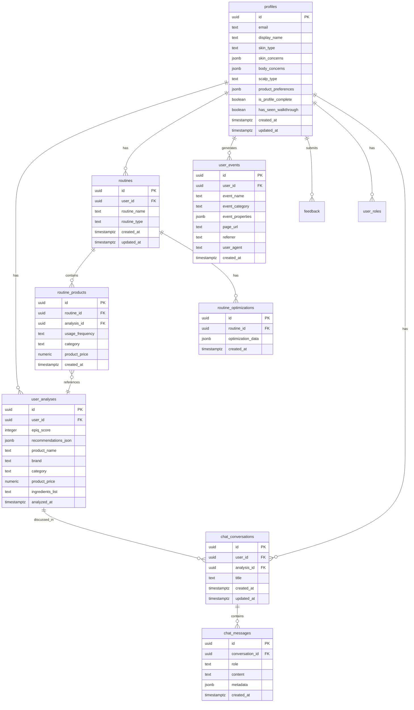

# Data Models & JSON Schemas

**Document Version:** 1.1  
**Last Updated:** November 23, 2025  
**Owner:** Engineering Team  
**Status:** Active

---

## Table of Contents

1. [Database Schema Overview](#database-schema-overview)
2. [Core Tables](#core-tables)
3. [Analytics Views](#analytics-views)
4. [Cache Tables](#cache-tables)
5. [JSON Schemas](#json-schemas)
6. [API Request/Response Payloads](#api-requestresponse-payloads)
7. [Frontend State Shapes](#frontend-state-shapes)

---

## Database Schema Overview

### Entity Relationship Diagram



### Database Design Principles

1. **Normalized Design**: Minimize data redundancy
2. **UUID Primary Keys**: Globally unique, URL-safe identifiers
3. **JSONB for Flexibility**: Schema-less data in `_json` columns
4. **Timestamps**: All tables track `created_at` (and `updated_at` where applicable)
5. **Soft Deletes**: Use flags instead of hard deletes (future)
6. **Foreign Keys**: Enforce referential integrity with `ON DELETE CASCADE`

---

## Core Tables

### profiles

**Purpose:** Store user account information and skin profile data.

**Schema:**

| Column | Type | Nullable | Default | Description |
|--------|------|----------|---------|-------------|
| `id` | UUID | No | auth.users FK | Primary key, matches auth.users.id |
| `email` | TEXT | Yes | NULL | User's email address |
| `display_name` | TEXT | Yes | NULL | User's display name |
| `skin_type` | ENUM | Yes | NULL | oily, dry, combination, normal |
| `skin_concerns` | JSONB | Yes | `[]` | Array of concern strings |
| `body_concerns` | JSONB | Yes | `[]` | Array of body concern strings |
| `scalp_type` | TEXT | Yes | NULL | Scalp/hair type description |
| `product_preferences` | JSONB | Yes | `{"face": true, "body": false, "hair": false}` | Product category preferences |
| `is_profile_complete` | BOOLEAN | Yes | false | Has user completed onboarding? |
| `has_seen_walkthrough` | BOOLEAN | Yes | false | Has user seen product walkthrough? |
| `created_at` | TIMESTAMPTZ | Yes | now() | Account creation timestamp |
| `updated_at` | TIMESTAMPTZ | Yes | now() | Last profile update timestamp |

**RLS Policies:**
- Users can view their own profile
- Users can update their own profile
- Users can create their own profile (on signup)

**TypeScript Interface:**

```typescript
interface Profile {
  id: string;
  email: string | null;
  display_name: string | null;
  skin_type: 'oily' | 'dry' | 'combination' | 'normal' | null;
  skin_concerns: string[];
  body_concerns: string[];
  scalp_type: string | null;
  product_preferences: {
    face: boolean;
    body: boolean;
    hair: boolean;
  };
  is_profile_complete: boolean;
  has_seen_walkthrough: boolean;
  created_at: string;
  updated_at: string;
}
```

**Example Row:**

```json
{
  "id": "a1b2c3d4-e5f6-7890-abcd-ef1234567890",
  "email": "emma@example.com",
  "display_name": "Emma",
  "skin_type": "oily",
  "skin_concerns": ["acne", "blackheads", "large_pores"],
  "body_concerns": [],
  "scalp_type": null,
  "product_preferences": {
    "face": true,
    "body": false,
    "hair": false
  },
  "is_profile_complete": true,
  "has_seen_walkthrough": true,
  "created_at": "2025-11-01T09:00:00.000Z",
  "updated_at": "2025-11-05T14:23:00.000Z"
}
```

---

### user_analyses

**Purpose:** Store product analysis results (EpiQ scores, AI recommendations).

**Schema:**

| Column | Type | Nullable | Default | Description |
|--------|------|----------|---------|-------------|
| `id` | UUID | No | gen_random_uuid() | Primary key |
| `user_id` | UUID | No | - | Foreign key to auth.users |
| `epiq_score` | INTEGER | Yes | NULL | 0-100 quality score |
| `recommendations_json` | JSONB | Yes | NULL | AI analysis results |
| `product_name` | TEXT | No | - | Product name |
| `brand` | TEXT | Yes | NULL | Brand name |
| `category` | TEXT | Yes | NULL | Product category |
| `product_price` | NUMERIC | Yes | NULL | Product price (USD) |
| `ingredients_list` | TEXT | No | - | Comma-separated ingredients |
| `image_url` | TEXT | Yes | NULL | User-uploaded product image |
| `analyzed_at` | TIMESTAMPTZ | Yes | now() | Analysis timestamp |

**RLS Policies:**
- Users can view their own analyses
- Users can create their own analyses

**TypeScript Interface:**

```typescript
interface UserAnalysis {
  id: string;
  user_id: string;
  epiq_score: number | null;
  recommendations_json: {
    overall_assessment: string;
    sub_scores: {                           // NEW: Detailed scoring breakdown
      ingredient_safety: number;            // 0-100
      skin_compatibility: number;           // 0-100
      active_quality: number;               // 0-100
      preservative_safety: number;          // 0-100
    };
    product_metadata: {                     // NEW: Product classification
      product_type: string;
      product_type_label: string;
      brand: string;
      category: string;
    };
    enriched_ingredients: Array<{           // NEW: Enhanced ingredient data
      name: string;
      role: string;
      explanation: string;
      molecular_weight: number | null;
      safety_profile: string;
      risk_score: number;
      category: 'safe' | 'beneficial' | 'problematic' | 'unverified';
    }>;
    key_actives: Array<{
      name: string;
      function: string;
      concentration?: string;
      benefits: string[];
    }>;
    red_flags: Array<{
      ingredient: string;
      concern: string;
      severity: 'low' | 'medium' | 'high';
    }>;
    suitable_for: string[];
    avoid_if: string[];
    routine_placement: string;
    better_alternatives?: Array<{
      name: string;
      reason: string;
      price_difference: number;
    }>;
    ai_explanation: {                       // NEW: Product-level AI insights
      answer_markdown: string;
      summary_one_liner: string;
      safety_level: 'low' | 'moderate' | 'high' | 'unknown';
      professional_referral: {
        needed: boolean;
        reason: string;
        suggested_professional_type: 'none' | 'dermatologist' | 'esthetician' | 'either';
      };
    };
  } | null;
  product_name: string;
  brand: string | null;
  category: string | null;
  product_price: number | null;
  ingredients_list: string;
  analyzed_at: string;
}
```

**Example Row:**

```json
{
  "id": "analysis-uuid-1234",
  "user_id": "user-uuid-5678",
  "epiq_score": 87,
  "recommendations_json": {
    "overall_assessment": "Excellent choice for dry, sensitive skin...",
    "key_actives": [
      {
        "name": "Ceramides",
        "function": "Barrier repair",
        "benefits": ["Restores lipid barrier", "Improves hydration"]
      }
    ],
    "red_flags": [],
    "suitable_for": ["dry", "normal", "sensitive"],
    "avoid_if": ["extremely_oily"],
    "routine_placement": "Morning and evening after cleansing",
    "better_alternatives": null
  },
  "product_name": "CeraVe Moisturizing Cream",
  "brand": "CeraVe",
  "category": "Moisturizer",
  "product_price": 18.99,
  "ingredients_list": "Water, Glycerin, Cetearyl Alcohol...",
  "analyzed_at": "2025-11-11T10:30:00.000Z"
}
```

---

### routines

**Purpose:** Store user's skincare routines.

**Schema:**

| Column | Type | Nullable | Default | Description |
|--------|------|----------|---------|-------------|
| `id` | UUID | No | gen_random_uuid() | Primary key |
| `user_id` | UUID | No | - | Foreign key to auth.users |
| `routine_name` | TEXT | No | - | User-defined routine name |
| `routine_type` | TEXT | Yes | 'face' | face, body, hair |
| `created_at` | TIMESTAMPTZ | No | now() | Creation timestamp |
| `updated_at` | TIMESTAMPTZ | No | now() | Last update timestamp |

**RLS Policies:**
- Users can view their own routines
- Users can create their own routines
- Users can update their own routines
- Users can delete their own routines

**TypeScript Interface:**

```typescript
interface Routine {
  id: string;
  user_id: string;
  routine_name: string;
  routine_type: 'face' | 'body' | 'hair';
  created_at: string;
  updated_at: string;
}
```

**Example Row:**

```json
{
  "id": "routine-uuid-abcd",
  "user_id": "user-uuid-5678",
  "routine_name": "My Morning Routine",
  "routine_type": "face",
  "created_at": "2025-11-10T08:00:00.000Z",
  "updated_at": "2025-11-11T09:15:00.000Z"
}
```

---

### routine_products

**Purpose:** Link products (analyses) to routines with usage frequency.

**Schema:**

| Column | Type | Nullable | Default | Description |
|--------|------|----------|---------|-------------|
| `id` | UUID | No | gen_random_uuid() | Primary key |
| `routine_id` | UUID | No | - | Foreign key to routines |
| `analysis_id` | UUID | No | - | Foreign key to user_analyses |
| `usage_frequency` | TEXT | No | - | "AM", "PM", "AM/PM", "Weekly" |
| `category` | TEXT | Yes | NULL | Product category |
| `product_price` | NUMERIC | Yes | NULL | Product price (cached) |
| `created_at` | TIMESTAMPTZ | No | now() | Added to routine timestamp |

**RLS Policies:**
- Users can view products in their routines
- Users can add products to their routines
- Users can update products in their routines
- Users can delete products from their routines

**TypeScript Interface:**

```typescript
interface RoutineProduct {
  id: string;
  routine_id: string;
  analysis_id: string;
  usage_frequency: 'AM' | 'PM' | 'AM/PM' | 'Weekly';
  category: string | null;
  product_price: number | null;
  created_at: string;
}
```

**Example Row:**

```json
{
  "id": "rp-uuid-1234",
  "routine_id": "routine-uuid-abcd",
  "analysis_id": "analysis-uuid-1234",
  "usage_frequency": "AM/PM",
  "category": "Moisturizer",
  "product_price": 18.99,
  "created_at": "2025-11-10T08:15:00.000Z"
}
```

---

### routine_optimizations

**Purpose:** Store routine optimization results.

**Schema:**

| Column | Type | Nullable | Default | Description |
|--------|------|----------|---------|-------------|
| `id` | UUID | No | gen_random_uuid() | Primary key |
| `routine_id` | UUID | No | - | Foreign key to routines |
| `optimization_data` | JSONB | No | - | Optimization insights |
| `created_at` | TIMESTAMPTZ | No | now() | Optimization timestamp |

**RLS Policies:**
- Users can view optimizations for their routines
- Users can create optimizations for their routines

**TypeScript Interface:**

```typescript
interface RoutineOptimization {
  id: string;
  routine_id: string;
  optimization_data: {
    summary: {
      current_cost: number;
      optimized_cost: number;
      savings: number;
      savings_percentage: number;
      products_analyzed: number;
    };
    insights: {
      redundancies: Array<{
        products: string[];
        ingredient: string;
        recommendation: string;
      }>;
      order_optimization: Array<{
        product: string;
        current_position: number;
        recommended_position: number;
        reason: string;
      }>;
      better_alternatives: Array<{
        current_product: string;
        alternative: string;
        price_difference: number;
        why_better: string;
      }>;
      missing_essentials: Array<{
        product_type: string;
        reason: string;
        recommendations: string[];
      }>;
    };
    routine_type: 'face' | 'body' | 'hair' | 'mixed';
  };
  created_at: string;
}
```

**Example Row:**

```json
{
  "id": "opt-uuid-9876",
  "routine_id": "routine-uuid-abcd",
  "optimization_data": {
    "summary": {
      "current_cost": 127.50,
      "optimized_cost": 89.00,
      "savings": 38.50,
      "savings_percentage": 30.2,
      "products_analyzed": 5
    },
    "insights": {
      "redundancies": [
        {
          "products": ["Product A", "Product B"],
          "ingredient": "Niacinamide",
          "recommendation": "Both contain 5%+ niacinamide..."
        }
      ],
      "order_optimization": [],
      "better_alternatives": [],
      "missing_essentials": [
        {
          "product_type": "Sunscreen",
          "reason": "No SPF detected...",
          "recommendations": ["La Roche-Posay", "EltaMD"]
        }
      ]
    },
    "routine_type": "face"
  },
  "created_at": "2025-11-11T11:00:00.000Z"
}
```

---

### saved_dupes

**Purpose:** Store user's saved dupe favorites from Dupe Discovery feature.

**Schema:**

| Column | Type | Nullable | Default | Description |
|--------|------|----------|---------|-------------|
| `id` | UUID | No | gen_random_uuid() | Primary key |
| `user_id` | UUID | No | - | Foreign key to auth.users |
| `source_product_id` | UUID | Yes | NULL | Original product being compared |
| `product_name` | TEXT | No | - | Dupe product name |
| `brand` | TEXT | Yes | NULL | Dupe brand name |
| `image_url` | TEXT | Yes | NULL | Product image URL |
| `reasons` | TEXT[] | Yes | NULL | Array of dupe reasons |
| `shared_ingredients` | TEXT[] | Yes | NULL | Shared ingredient names |
| `price_estimate` | TEXT | Yes | NULL | Price string |
| `saved_at` | TIMESTAMPTZ | Yes | now() | When saved |

**RLS Policies:**
- Users can view their own saved dupes
- Users can save dupes
- Users can unsave (delete) their dupes

**TypeScript Interface:**

```typescript
interface SavedDupe {
  id: string;
  user_id: string;
  source_product_id: string | null;
  product_name: string;
  brand: string | null;
  image_url: string | null;
  reasons: string[] | null;
  shared_ingredients: string[] | null;
  price_estimate: string | null;
  saved_at: string;
}
```

---

**Purpose:** Track user actions for analytics.

**Schema:**

| Column | Type | Nullable | Default | Description |
|--------|------|----------|---------|-------------|
| `id` | UUID | No | gen_random_uuid() | Primary key |
| `user_id` | UUID | Yes | NULL | Foreign key (nullable for anonymous) |
| `event_name` | TEXT | No | - | Event identifier |
| `event_category` | TEXT | No | - | Event category |
| `event_properties` | JSONB | Yes | `{}` | Event metadata |
| `page_url` | TEXT | Yes | NULL | URL where event occurred |
| `referrer` | TEXT | Yes | NULL | Previous page URL |
| `user_agent` | TEXT | Yes | NULL | Browser/device info |
| `created_at` | TIMESTAMPTZ | No | now() | Event timestamp |

**RLS Policies:**
- Users can view their own events
- Users can insert their own events

**TypeScript Interface:**

```typescript
interface UserEvent {
  id: string;
  user_id: string | null;
  event_name: string;
  event_category: 'navigation' | 'engagement' | 'conversion' | 'feature_adoption' | 'feedback';
  event_properties: Record<string, any>;
  page_url: string | null;
  referrer: string | null;
  user_agent: string | null;
  created_at: string;
}
```

**Example Row:**

```json
{
  "id": "event-uuid-7890",
  "user_id": "user-uuid-5678",
  "event_name": "demo_cta_clicked",
  "event_category": "engagement",
  "event_properties": {
    "location": "hero",
    "cta_text": "Try Demo Analysis",
    "device_type": "desktop"
  },
  "page_url": "/",
  "referrer": "https://instagram.com/p/xyz",
  "user_agent": "Mozilla/5.0 (Macintosh; Intel Mac OS X 10_15_7)...",
  "created_at": "2025-11-11T10:15:00.000Z"
}
```

---

### feedback

**Purpose:** Store user feedback and ratings.

**Schema:**

| Column | Type | Nullable | Default | Description |
|--------|------|----------|---------|-------------|
| `id` | UUID | No | gen_random_uuid() | Primary key |
| `user_id` | UUID | Yes | NULL | Foreign key (nullable for anonymous) |
| `feedback_type` | TEXT | No | - | "bug", "feature_request", "general", etc. |
| `message` | TEXT | No | - | Feedback text |
| `rating` | INTEGER | Yes | NULL | 1-5 star rating |
| `context_type` | TEXT | Yes | NULL | "analysis", "routine", "general" |
| `context_id` | UUID | Yes | NULL | Related analysis/routine ID |
| `page_url` | TEXT | Yes | NULL | URL where feedback given |
| `created_at` | TIMESTAMPTZ | No | now() | Feedback timestamp |

**RLS Policies:**
- Anyone can submit feedback
- Users can view their own feedback

**TypeScript Interface:**

```typescript
interface Feedback {
  id: string;
  user_id: string | null;
  feedback_type: 'bug' | 'feature_request' | 'general' | 'content_accuracy';
  message: string;
  rating: number | null;
  context_type: 'analysis' | 'routine' | 'general' | null;
  context_id: string | null;
  page_url: string | null;
  created_at: string;
}
```

**Example Row:**

```json
{
  "id": "feedback-uuid-5555",
  "user_id": "user-uuid-5678",
  "feedback_type": "feature_request",
  "message": "It would be great to compare 3+ products side by side",
  "rating": 5,
  "context_type": "general",
  "context_id": null,
  "page_url": "/analysis/abc123",
  "created_at": "2025-11-11T12:00:00.000Z"
}
```

---

### user_roles

**Purpose:** Store user roles (admin, moderator, user).

**Schema:**

| Column | Type | Nullable | Default | Description |
|--------|------|----------|---------|-------------|
| `id` | UUID | No | gen_random_uuid() | Primary key |
| `user_id` | UUID | No | - | Foreign key to auth.users |
| `role` | ENUM | No | - | admin, moderator, user |
| `created_at` | TIMESTAMPTZ | Yes | now() | Role assigned timestamp |

**RLS Policies:**
- Users can view their own roles
- Admins can manage all roles

**TypeScript Interface:**

```typescript
interface UserRole {
  id: string;
  user_id: string;
  role: 'admin' | 'moderator' | 'user';
  created_at: string;
}
```

**Example Row:**

```json
{
  "id": "role-uuid-1111",
  "user_id": "user-uuid-5678",
  "role": "admin",
  "created_at": "2025-11-01T09:00:00.000Z"
}
```

---

## Analytics Views

### cta_performance_metrics

**Purpose:** Aggregate CTA click data by date and location.

**Columns:**
- `date` (date): Day of CTA clicks
- `event_name` (text): CTA event name
- `location` (text): Where CTA was clicked
- `cta_text` (text): Button text
- `total_clicks` (bigint): Total clicks
- `unique_users` (bigint): Unique users who clicked

**Example Row:**

```json
{
  "date": "2025-11-11",
  "event_name": "demo_cta_clicked",
  "location": "hero",
  "cta_text": "Try Demo Analysis",
  "total_clicks": 247,
  "unique_users": 189
}
```

---

### conversion_funnel_metrics

**Purpose:** Track conversion rates through user journey.

**Columns:**
- `date` (date): Day of events
- `homepage_views` (bigint): Homepage visits
- `demo_clicks` (bigint): Demo CTA clicks
- `signup_clicks` (bigint): Signup CTA clicks
- `completed_onboarding` (bigint): Completed onboarding
- `first_analysis` (bigint): Completed first analysis
- `demo_ctr` (numeric): Demo CTR %
- `signup_ctr` (numeric): Signup CTR %
- `onboarding_completion_rate` (numeric): Onboarding completion %

**Example Row:**

```json
{
  "date": "2025-11-11",
  "homepage_views": 1250,
  "demo_clicks": 487,
  "signup_clicks": 122,
  "completed_onboarding": 85,
  "first_analysis": 71,
  "demo_ctr": 38.96,
  "signup_ctr": 9.76,
  "onboarding_completion_rate": 69.67
}
```

---

### user_journey_analysis

**Purpose:** Overall user journey metrics (aggregate, not daily).

**Columns:**
- `total_users` (bigint): Total unique users
- `viewed_homepage` (bigint): Users who viewed homepage
- `clicked_demo` (bigint): Users who clicked demo
- `clicked_signup` (bigint): Users who clicked signup
- `completed_onboarding` (bigint): Users who completed onboarding
- `completed_first_analysis` (bigint): Users who completed analysis
- `homepage_to_demo_rate` (numeric): Conversion %
- `homepage_to_signup_rate` (numeric): Conversion %

**Example Row:**

```json
{
  "total_users": 5432,
  "viewed_homepage": 4890,
  "clicked_demo": 1956,
  "clicked_signup": 978,
  "completed_onboarding": 684,
  "completed_first_analysis": 572,
  "homepage_to_demo_rate": 40.00,
  "homepage_to_signup_rate": 20.00
}
```

---

### engagement_metrics_summary

**Purpose:** Daily engagement metrics aggregation.

**Columns:**
- `date` (date): Day of metrics
- `daily_active_users` (bigint): Unique users active
- `engagement_events` (bigint): Engagement events count
- `conversion_events` (bigint): Conversion events count
- `analyses` (bigint): Product analyses completed
- `routines_created` (bigint): Routines created
- `routines_optimized` (bigint): Routine optimizations run
- `avg_engagement_per_user` (numeric): Avg events per user

**Example Row:**

```json
{
  "date": "2025-11-11",
  "daily_active_users": 342,
  "engagement_events": 1247,
  "conversion_events": 85,
  "analyses": 178,
  "routines_created": 23,
  "routines_optimized": 12,
  "avg_engagement_per_user": 3.65
}
```

---

## Cache Tables

### ingredient_cache

**Purpose:** Cache PubChem ingredient data to reduce API calls.

**Schema:**

| Column | Type | Nullable | Default | Description |
|--------|------|----------|---------|-------------|
| `id` | UUID | No | gen_random_uuid() | Primary key |
| `ingredient_name` | TEXT | No | - | INCI name (unique) |
| `pubchem_cid` | TEXT | Yes | NULL | PubChem compound ID |
| `molecular_weight` | NUMERIC | Yes | NULL | Molecular weight |
| `properties_json` | JSONB | Yes | NULL | Ingredient properties |
| `cached_at` | TIMESTAMPTZ | Yes | now() | Cache timestamp |

**Example Row:**

```json
{
  "id": "cache-uuid-1234",
  "ingredient_name": "Niacinamide",
  "pubchem_cid": "936",
  "molecular_weight": 122.12,
  "properties_json": {
    "iupac_name": "Pyridine-3-carboxamide",
    "synonyms": ["Nicotinamide", "Vitamin B3"],
    "safety_profile": {
      "comedogenic_rating": 0,
      "irritancy_potential": "low"
    },
    "functions": ["Brightening", "Anti-inflammatory"]
  },
  "cached_at": "2025-11-01T10:00:00.000Z"
}
```

---

### product_cache

**Purpose:** Cache Open Beauty Facts product data.

**Schema:**

| Column | Type | Nullable | Default | Description |
|--------|------|----------|---------|-------------|
| `id` | UUID | No | gen_random_uuid() | Primary key |
| `barcode` | TEXT | No | - | Product barcode (unique) |
| `obf_data_json` | JSONB | No | - | OBF product data |
| `cached_at` | TIMESTAMPTZ | Yes | now() | Cache timestamp |

**Example Row:**

```json
{
  "id": "cache-uuid-5678",
  "barcode": "3337875597180",
  "obf_data_json": {
    "product_name": "Moisturizing Cream",
    "brand": "CeraVe",
    "category": "Face moisturizer",
    "ingredients": "Water, Glycerin...",
    "image_url": "https://..."
  },
  "cached_at": "2025-11-10T14:30:00.000Z"
}
```

---

## JSON Schemas

### AnalysisResult Schema

**Used in:** `user_analyses.recommendations_json`

```typescript
interface AnalysisResult {
  overall_assessment: string;
  key_actives: KeyActive[];
  red_flags: RedFlag[];
  suitable_for: string[];
  avoid_if: string[];
  routine_placement: string;
  better_alternatives?: BetterAlternative[] | null;
}

interface KeyActive {
  name: string;
  function: string;
  concentration?: string;
  benefits: string[];
}

interface RedFlag {
  ingredient: string;
  concern: string;
  severity: 'low' | 'medium' | 'high';
}

interface BetterAlternative {
  name: string;
  reason: string;
  price_difference: number;
}
```

**Example:**

```json
{
  "overall_assessment": "Great choice for oily, acne-prone skin...",
  "key_actives": [
    {
      "name": "Salicylic Acid",
      "function": "Chemical exfoliant",
      "concentration": "2%",
      "benefits": ["Unclogs pores", "Reduces blackheads"]
    }
  ],
  "red_flags": [
    {
      "ingredient": "Fragrance",
      "concern": "Potential irritant",
      "severity": "medium"
    }
  ],
  "suitable_for": ["oily", "combination"],
  "avoid_if": ["sensitive", "dry"],
  "routine_placement": "Evening, after cleansing",
  "better_alternatives": null
}
```

---

### OptimizationData Schema

**Used in:** `routine_optimizations.optimization_data`

```typescript
interface OptimizationData {
  summary: OptimizationSummary;
  insights: OptimizationInsights;
  routine_type: 'face' | 'body' | 'hair' | 'mixed';
}

interface OptimizationSummary {
  current_cost: number;
  optimized_cost: number;
  savings: number;
  savings_percentage: number;
  products_analyzed: number;
}

interface OptimizationInsights {
  redundancies: Redundancy[];
  order_optimization: OrderOptimization[];
  better_alternatives: BetterAlternative[];
  missing_essentials: MissingEssential[];
}

interface Redundancy {
  products: string[];
  ingredient: string;
  recommendation: string;
}

interface OrderOptimization {
  product: string;
  current_position: number;
  recommended_position: number;
  reason: string;
}

interface MissingEssential {
  product_type: string;
  reason: string;
  recommendations: string[];
}
```

---

### UserProfile Schema

**Used in:** `profiles` table structure

```typescript
interface UserProfile {
  id: string;
  email: string | null;
  display_name: string | null;
  skin_type: SkinType | null;
  skin_concerns: string[];
  body_concerns: string[];
  scalp_type: string | null;
  product_preferences: ProductPreferences;
  is_profile_complete: boolean;
  has_seen_walkthrough: boolean;
  created_at: string;
  updated_at: string;
}

type SkinType = 'oily' | 'dry' | 'combination' | 'normal';

interface ProductPreferences {
  face: boolean;
  body: boolean;
  hair: boolean;
}
```

---

### EventProperties Schema

**Used in:** `user_events.event_properties`

```typescript
interface EventProperties {
  // Common properties
  location?: string;           // "hero", "footer", etc.
  cta_text?: string;          // Button text
  device_type?: string;       // "desktop", "mobile", "tablet"
  
  // Analysis-specific
  product_name?: string;
  epiq_score?: number;
  category?: string;
  
  // Routine-specific
  routine_id?: string;
  routine_type?: string;
  product_count?: number;
  savings?: number;
  
  // Navigation-specific
  page_name?: string;
  path?: string;
  referrer?: string;
  
  // Feedback-specific
  rating?: number;
  feedback_type?: string;
  
  // Custom properties
  [key: string]: any;
}
```

---

## API Request/Response Payloads

### Analyze Product Request

```typescript
interface AnalyzeProductRequest {
  productName: string;
  ingredients: string;
  brand?: string;
  category?: string;
  price?: number;
  userProfile?: {
    skin_type?: 'oily' | 'dry' | 'combination' | 'normal';
    skin_concerns?: string[];
  };
}
```

**Example:**

```json
{
  "productName": "CeraVe Moisturizing Cream",
  "ingredients": "Water, Glycerin, Cetearyl Alcohol, Caprylic/Capric Triglyceride...",
  "brand": "CeraVe",
  "category": "Moisturizer",
  "price": 18.99,
  "userProfile": {
    "skin_type": "dry",
    "skin_concerns": ["sensitivity", "dryness"]
  }
}
```

---

### Analyze Product Response

```typescript
interface AnalyzeProductResponse {
  epiq_score: number;
  recommendations_json: AnalysisResult;
  analysis_id: string;
}
```

**Example:**

```json
{
  "epiq_score": 87,
  "recommendations_json": {
    "overall_assessment": "Excellent choice...",
    "key_actives": [...],
    "red_flags": [],
    "suitable_for": ["dry", "normal"],
    "avoid_if": ["extremely_oily"],
    "routine_placement": "AM/PM after cleansing"
  },
  "analysis_id": "analysis-uuid-1234"
}
```

---

### Optimize Routine Request

```typescript
interface OptimizeRoutineRequest {
  routineId: string;
}
```

**Example:**

```json
{
  "routineId": "routine-uuid-abcd"
}
```

---

### Optimize Routine Response

```typescript
interface OptimizeRoutineResponse {
  optimization_id: string;
  routine_id: string;
  optimization_data: OptimizationData;
}
```

---

## Frontend State Shapes

### React Query Cache Structure

**Key Pattern:** `['resource', identifier, filters?]`

```typescript
// User profile
['profile', userId]

// User analyses
['analyses', userId]
['analyses', userId, { category: 'Moisturizer' }]

// Single analysis
['analysis', analysisId]

// User routines
['routines', userId]
['routine', routineId]

// Routine products
['routine-products', routineId]

// Routine optimization
['routine-optimization', routineId]

// Analytics (admin only)
['cta-performance']
['conversion-funnel']
['user-journey']
['engagement-metrics']
```

**Example State:**

```typescript
// React Query cache structure
{
  queries: {
    '["analyses","user-uuid-5678"]': {
      data: [
        {
          id: 'analysis-uuid-1234',
          product_name: 'CeraVe Cream',
          epiq_score: 87,
          analyzed_at: '2025-11-11T10:30:00Z'
        }
      ],
      status: 'success',
      dataUpdatedAt: 1699704600000
    }
  }
}
```

---

## Document Version History

| Version | Date | Author | Changes |
|---------|------|--------|---------|
| 1.0 | Nov 11, 2025 | Engineering Team | Initial comprehensive data models documentation |

---

**For Questions or Updates:**  
Contact: Backend Engineer or CTO  
Slack Channel: #backend

**Related Documentation:**
- [API Documentation](./API-Documentation.md)
- [Database Migration Guide](./Database-Migration-Guide.md)
- [Technical Stack & Setup](./Technical-Stack-Setup.md)
- [Engineering SOPs](./Engineering-SOPs.md)

---

**End of Data Models & JSON Schemas**
