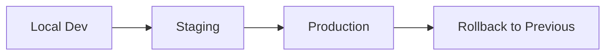
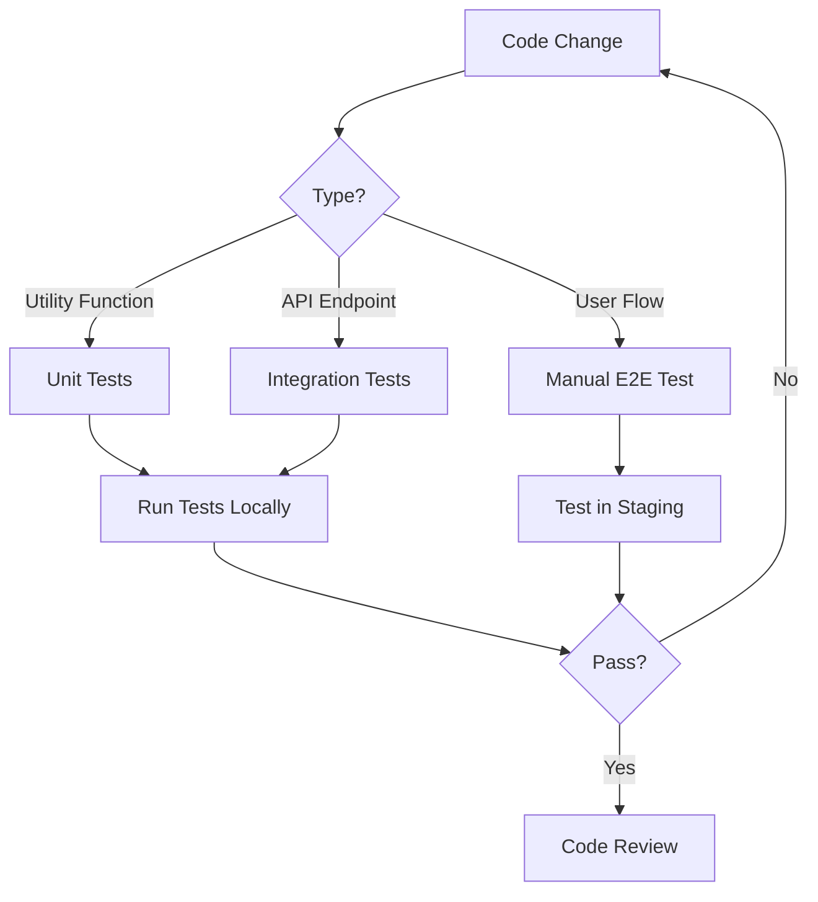

# Engineering Standard Operating Procedures (SOPs)

**Document Version:** 1.1  
**Last Updated:** November 23, 2025  
**Owner:** Engineering Team  
**Status:** Active

---

## Table of Contents

1. [Local Development Setup](#local-development-setup)
2. [Git Workflow & Branching Strategy](#git-workflow--branching-strategy)
3. [Code Review Process](#code-review-process)
4. [Deployment Process](#deployment-process)
5. [Edge Function Development](#edge-function-development)
6. [Testing Standards](#testing-standards)
7. [Monitoring & Debugging](#monitoring--debugging)
8. [Security Best Practices](#security-best-practices)

---

## Local Development Setup

### Prerequisites

**Required Software:**
- Node.js 18.x or higher
- Bun 1.0+ (package manager)
- Git 2.30+
- VS Code (recommended) or your preferred IDE

**Required Accounts:**
- GitHub access to repository
- Lovable Cloud access (for Supabase dashboard)
- Slack workspace access

### Step-by-Step Setup

#### 1. Clone Repository

```bash
git clone https://github.com/skinlytix/skinlytix-app.git
cd skinlytix-app
```

#### 2. Install Dependencies

```bash
bun install
```

#### 3. Environment Configuration

The `.env` file is **auto-generated** by Lovable Cloud and should never be edited manually. It contains:

```bash
VITE_SUPABASE_URL=https://yflbjaetupvakadqjhfb.supabase.co
VITE_SUPABASE_PUBLISHABLE_KEY=eyJhbGciOiJIUzI1NiIsInR5cCI6IkpXVCJ9...
VITE_SUPABASE_PROJECT_ID=yflbjaetupvakadqjhfb
```

**Note:** These values are automatically provisioned. Do not commit `.env` to version control.

#### 4. Start Development Server

```bash
bun run dev
```

Application will be available at `http://localhost:8080`

#### 5. Verify Database Connection

Navigate to `http://localhost:8080/auth` and verify you can see the authentication page without errors.

Check browser console for any Supabase connection errors:
```javascript
// Should see no errors related to:
// - "Invalid API key"
// - "Could not connect to Supabase"
```

### VS Code Recommended Extensions

```json
{
  "recommendations": [
    "dbaeumer.vscode-eslint",
    "esbenp.prettier-vscode",
    "bradlc.vscode-tailwindcss",
    "bierner.markdown-mermaid",
    "supabase.vite",
    "ms-vscode.vscode-typescript-next"
  ]
}
```

### Local Database Seeding (Optional)

For testing with sample data:

```bash
# Run SQL seed script via Supabase dashboard
# Cloud → Database → SQL Editor
# Paste contents of docs/technical/seed-data.sql
```

**Sample seed data includes:**
- Test user profiles (all skin types)
- Sample product analyses
- Demo routines
- Cache data for common ingredients

---

## Git Workflow & Branching Strategy

### Branch Naming Conventions

```
feature/short-description
bugfix/issue-number-short-description
hotfix/critical-issue-description
refactor/component-name
docs/documentation-update
```

**Examples:**
- `feature/exit-intent-popup`
- `bugfix/123-ocr-memory-leak`
- `hotfix/analytics-admin-check`
- `refactor/analysis-result-component`
- `docs/add-api-documentation`

### Commit Message Standards

Follow [Conventional Commits](https://www.conventionalcommits.org/):

```
<type>(<scope>): <subject>

<body>

<footer>
```

**Types:**
- `feat`: New feature
- `fix`: Bug fix
- `docs`: Documentation only
- `style`: Code style changes (formatting, no logic change)
- `refactor`: Code refactoring
- `perf`: Performance improvement
- `test`: Adding or updating tests
- `chore`: Maintenance tasks

**Examples:**

```bash
feat(analytics): add CTA performance tracking

Implemented event tracking for demo and signup CTAs with
location-based segmentation. Added useTracking hook for
consistent event capture across components.

Closes #234

---

fix(ocr): prevent memory leak in Tesseract worker

Worker was not being terminated after analysis completion,
causing memory accumulation over multiple scans.

Fixes #456

---

refactor(routine): extract optimization logic to custom hook

Moved routine optimization state management from component
to useRoutineOptimization hook for better reusability.
```

### Pull Request Process

#### 1. Create Feature Branch

```bash
git checkout main
git pull origin main
git checkout -b feature/your-feature-name
```

#### 2. Make Changes and Commit

```bash
git add .
git commit -m "feat(scope): description"
git push origin feature/your-feature-name
```

#### 3. Open Pull Request

**PR Title Format:**
```
[Feature/Fix/Refactor] Brief description
```

**PR Description Template:**

```markdown
## Description
Brief summary of changes

## Type of Change
- [ ] Bug fix (non-breaking change which fixes an issue)
- [ ] New feature (non-breaking change which adds functionality)
- [ ] Breaking change (fix or feature that would cause existing functionality to not work as expected)
- [ ] Documentation update

## Changes Made
- Changed X to improve Y
- Added Z component for feature A
- Refactored B to use pattern C

## Testing
- [ ] Tested locally in dev environment
- [ ] Tested in staging
- [ ] Added/updated tests
- [ ] Verified no console errors
- [ ] Checked mobile responsiveness

## Screenshots (if applicable)
[Add screenshots for UI changes]

## Related Issues
Closes #123
```

#### 4. Code Review Requirements

**All PRs require:**
- ✅ At least 1 approval from team member
- ✅ All CI checks passing
- ✅ No merge conflicts with main
- ✅ Self-review completed

**Review turnaround time:** Within 24 hours for standard PRs, 2 hours for hotfixes

#### 5. Merge Strategy

```bash
# Use squash and merge for feature branches
# This keeps main branch history clean
```

**After merge:**
```bash
git checkout main
git pull origin main
git branch -d feature/your-feature-name
git push origin --delete feature/your-feature-name
```

---

## Code Review Process

### Code Review Checklist

#### Security Review
- [ ] No hardcoded API keys or secrets
- [ ] RLS policies properly implemented on new tables
- [ ] User input is validated and sanitized
- [ ] Authentication checks present for protected routes
- [ ] No SQL injection vulnerabilities in queries
- [ ] Admin checks use server-side validation (not client-side)
- [ ] Sensitive data not exposed in client-side code
- [ ] CORS headers properly configured in edge functions

#### Performance Review
- [ ] No N+1 query problems
- [ ] Expensive operations cached appropriately
- [ ] Images optimized and lazy-loaded
- [ ] React Query used for data fetching with proper stale times
- [ ] No unnecessary re-renders (check React DevTools)
- [ ] Memoization used where appropriate (useMemo, useCallback)
- [ ] Bundle size impact checked (large libraries)

#### Code Quality
- [ ] TypeScript types properly defined (no `any` usage)
- [ ] Components are reasonably sized (<300 lines)
- [ ] Functions are single-purpose and testable
- [ ] Naming is clear and follows conventions
- [ ] Comments explain "why" not "what"
- [ ] No console.log statements in production code
- [ ] Error boundaries implemented for critical sections

#### UI/UX Review
- [ ] Design system tokens used (no hardcoded colors)
- [ ] Responsive design works on mobile (320px+) and desktop
- [ ] Loading states shown for async operations
- [ ] Error states handled gracefully with user-friendly messages
- [ ] Accessibility: semantic HTML, ARIA labels, keyboard navigation
- [ ] Dark mode compatibility (if applicable)
- [ ] Toast notifications for user feedback on actions

#### Testing
- [ ] Unit tests added for new utility functions
- [ ] Integration tests for API endpoints
- [ ] Edge cases considered and handled
- [ ] Test coverage doesn't decrease

### Review Response Time SLAs

| Priority | Response Time | Completion Time |
|----------|--------------|-----------------|
| Hotfix | 30 minutes | 2 hours |
| High Priority | 4 hours | 1 day |
| Normal | 24 hours | 3 days |
| Low Priority | 48 hours | 1 week |

### Giving Feedback

**Good feedback is:**
- Specific: Point to exact lines
- Constructive: Suggest solutions
- Actionable: Provide examples
- Respectful: Assume positive intent

**Examples:**

❌ Bad: "This component is messy"

✅ Good: "Consider extracting the form logic into a custom hook for better reusability. Example: `useProductForm()` could manage form state and validation."

❌ Bad: "This won't scale"

✅ Good: "This query might have performance issues at scale. Consider adding an index on `user_id` and `created_at` columns for faster lookups."

---

## Progressive Disclosure UI Pattern (Collapsible Components)

### When to Use

Use collapsible components to reduce initial cognitive load on data-heavy pages while maintaining access to detailed information.

### Implementation Pattern

```tsx
const [isExpanded, setIsExpanded] = useState(false); // Default: collapsed

return (
  <div className="rounded-lg border bg-card">
    {/* Header (always visible) */}
    <button
      onClick={() => setIsExpanded(!isExpanded)}
      className="w-full flex items-center justify-between p-4"
    >
      <h3 className="font-semibold">{title}</h3>
      <ChevronDown
        className={cn(
          "h-5 w-5 transition-transform duration-300",
          isExpanded && "rotate-180"
        )}
      />
    </button>

    {/* Content (collapsible) */}
    <div
      className={cn(
        "overflow-hidden transition-all duration-300",
        isExpanded ? "max-h-[3000px] opacity-100" : "max-h-0 opacity-0"
      )}
    >
      <div className="p-4 pt-0">{content}</div>
    </div>
  </div>
);
```

### Design Principles

1. **Default to Collapsed** for secondary content
2. **Keep Critical Metrics** always visible (e.g., EpiQ score)
3. **Smooth Transitions** (300ms duration recommended)
4. **Clear Visual Affordance** (chevron icon rotation)
5. **Keyboard Navigation** (Enter/Space to toggle)
6. **Accessibility** (aria-expanded, role="button")

### Current Implementation

**Analysis Page Collapsible Sections:**
- ✅ Score Breakdown Accordion (4 sub-scores) - Default: collapsed
- ✅ AI Explanation Accordion (product-level insights) - Default: collapsed
- ✅ Ingredient Risk Heatmap (visual grid) - Default: collapsed
- 🔒 EpiQ Score Gauge - Always visible (non-collapsible)

**Benefits:**
- Reduced initial page height by ~40%
- Progressive disclosure of complexity
- Improved mobile scrolling experience
- Faster perceived load time

---

## Deployment Process

### Deployment Environments



#### Environment Details

| Environment | URL | Purpose | Auto-Deploy |
|-------------|-----|---------|-------------|
| **Local** | localhost:8080 | Development & testing | N/A |
| **Staging** | staging.skinlytix.lovable.app | Pre-production testing | On push to `main` |
| **Production** | skinlytix.lovable.app | Live user traffic | Manual publish |

### Deployment Workflow

#### Staging Deployment (Automatic)

```bash
# Merge PR to main
git checkout main
git pull origin main

# Staging automatically builds and deploys
# No manual action required
```

**Auto-deployed on:**
- PR merge to `main` branch
- Direct push to `main` (not recommended)

**Deployment includes:**
- Frontend build (Vite)
- Edge functions deployment
- Database migrations execution
- Environment variables sync

#### Production Deployment (Manual)

**Pre-Deployment Checklist:**

- [ ] All changes tested in staging
- [ ] QA sign-off obtained
- [ ] Database backup verified (auto-backup in Lovable Cloud)
- [ ] Release notes prepared
- [ ] Stakeholders notified (if user-facing changes)
- [ ] Deployment window scheduled (off-peak hours)

**Deployment Steps:**

1. **Navigate to Lovable Editor**
   - Open project in Lovable
   - Click "Publish" button (top-right)

2. **Review Changes**
   - Review diff of changes since last publish
   - Verify all intended features included

3. **Publish**
   - Click "Update" to publish to production
   - Monitor deployment progress

4. **Post-Deployment Verification**
   - Visit production URL
   - Test critical user flows:
     - [ ] Homepage loads
     - [ ] Authentication works
     - [ ] Product analysis completes
     - [ ] Routine creation functional
     - [ ] Analytics dashboard accessible (admin)
   - Check error monitoring for spikes
   - Verify performance metrics (Lighthouse score)

**Production Deployment Timing:**

Recommended windows (PST):
- **Weekdays:** 10 AM - 2 PM (low traffic, team available)
- **Avoid:** Friday afternoons, weekends, holidays
- **Emergency Hotfix:** Anytime with CTO approval

### Database Migrations

#### Migration Execution

**Important:** Database migrations in Lovable Cloud execute **immediately** upon approval, affecting both staging and production.

```sql
-- Example migration file
-- supabase/migrations/20251111_add_user_preferences.sql

-- Add new column with safe default
ALTER TABLE profiles 
ADD COLUMN IF NOT EXISTS notification_preferences JSONB 
DEFAULT '{"email": true, "push": false}'::jsonb;

-- Create index for performance
CREATE INDEX IF NOT EXISTS idx_profiles_notification_preferences 
ON profiles USING gin(notification_preferences);

-- Update RLS policies if needed
CREATE POLICY "Users can update their notification preferences"
ON profiles FOR UPDATE
USING (auth.uid() = id)
WITH CHECK (auth.uid() = id);
```

**Migration Best Practices:**

1. **Always use `IF NOT EXISTS`** to make migrations idempotent
2. **Add default values** for new columns to prevent errors
3. **Test locally first** before approval
4. **Never drop columns** without deprecation period (add column, migrate data, wait 1 week, then drop)
5. **Coordinate with team** before large migrations

### Rollback Procedures

#### When to Rollback

- Critical bug affecting all users
- Data corruption detected
- Performance degradation >50%
- Security vulnerability introduced

#### Rollback Process

**Frontend Rollback:**

1. **Via Lovable History**
   - Open project in Lovable
   - Click project name → History
   - Find last working version
   - Click "Restore"
   - Publish to production

**Database Rollback:**

Database migrations **cannot be automatically rolled back**. Forward-fix required:

```sql
-- Example forward fix
-- If you added a NOT NULL constraint that breaks things:

ALTER TABLE profiles 
ALTER COLUMN new_column DROP NOT NULL;

-- Or provide default value
UPDATE profiles 
SET new_column = 'default_value' 
WHERE new_column IS NULL;
```

**Edge Function Rollback:**

Edge functions deploy immediately. To rollback:

1. Revert code changes in repository
2. Push to main (triggers redeployment)
3. Verify function behavior in logs

---

## Edge Function Development

### Creating a New Edge Function

#### 1. Create Function Directory

```bash
# Do not create manually - use Lovable Cloud UI or let AI create
# Functions are auto-created in: supabase/functions/<function-name>/
```

#### 2. Write Function Code

**Example: `supabase/functions/analyze-product/index.ts`**

```typescript
import { serve } from "https://deno.land/std@0.168.0/http/server.ts";
import { createClient } from "https://esm.sh/@supabase/supabase-js@2";

const corsHeaders = {
  'Access-Control-Allow-Origin': '*',
  'Access-Control-Allow-Headers': 'authorization, x-client-info, apikey, content-type',
};

serve(async (req) => {
  // Handle CORS preflight
  if (req.method === 'OPTIONS') {
    return new Response(null, { headers: corsHeaders });
  }

  try {
    // Get environment variables
    const supabaseUrl = Deno.env.get('SUPABASE_URL')!;
    const supabaseKey = Deno.env.get('SUPABASE_SERVICE_ROLE_KEY')!;
    const lovableApiKey = Deno.env.get('LOVABLE_API_KEY')!;

    // Create Supabase client
    const supabase = createClient(supabaseUrl, supabaseKey);

    // Parse request
    const { productName, ingredients } = await req.json();

    // Validate input
    if (!productName || !ingredients) {
      return new Response(
        JSON.stringify({ error: 'Missing required fields' }),
        { status: 400, headers: { ...corsHeaders, 'Content-Type': 'application/json' } }
      );
    }

    // Call AI API
    const response = await fetch('https://ai.gateway.lovable.dev/v1/chat/completions', {
      method: 'POST',
      headers: {
        'Authorization': `Bearer ${lovableApiKey}`,
        'Content-Type': 'application/json',
      },
      body: JSON.stringify({
        model: 'google/gemini-2.5-flash',
        messages: [
          { role: 'system', content: 'You are an expert cosmetic chemist...' },
          { role: 'user', content: `Analyze: ${ingredients}` }
        ],
      }),
    });

    // Handle rate limiting
    if (response.status === 429) {
      return new Response(
        JSON.stringify({ error: 'Rate limit exceeded. Please try again later.' }),
        { status: 429, headers: { ...corsHeaders, 'Content-Type': 'application/json' } }
      );
    }

    if (response.status === 402) {
      return new Response(
        JSON.stringify({ error: 'AI credits depleted. Please contact support.' }),
        { status: 402, headers: { ...corsHeaders, 'Content-Type': 'application/json' } }
      );
    }

    const aiData = await response.json();

    // Return result
    return new Response(
      JSON.stringify({ analysis: aiData.choices[0].message.content }),
      { headers: { ...corsHeaders, 'Content-Type': 'application/json' } }
    );

  } catch (error) {
    console.error('Error in analyze-product:', error);
    return new Response(
      JSON.stringify({ error: error.message }),
      { status: 500, headers: { ...corsHeaders, 'Content-Type': 'application/json' } }
    );
  }
});
```

#### 3. Configure Function (if needed)

**`supabase/config.toml`** (auto-generated, but verify):

```toml
[functions.analyze-product]
verify_jwt = true  # Require authentication

[functions.webhook-handler]
verify_jwt = false  # Public endpoint (webhooks)
```

#### 4. Test Locally

```typescript
// In your React component
import { supabase } from '@/integrations/supabase/client';

const { data, error } = await supabase.functions.invoke('analyze-product', {
  body: {
    productName: 'Test Moisturizer',
    ingredients: 'Water, Glycerin, Niacinamide'
  }
});

if (error) console.error('Function error:', error);
console.log('Result:', data);
```

#### 5. Deploy

Edge functions deploy **automatically** on push to main. No manual deployment needed.

**Verify deployment:**
- Check Lovable Cloud → Functions
- View logs for function execution
- Test from production environment

### Adding Secrets to Edge Functions

**Never hardcode API keys!** Use Lovable Cloud secrets management:

1. **Add Secret via AI:**
   ```
   "I need to add an OpenAI API key"
   ```
   AI will trigger secret addition flow

2. **Use Secret in Function:**
   ```typescript
   const openaiKey = Deno.env.get('OPENAI_API_KEY');
   ```

**Available Secrets:**
- `LOVABLE_API_KEY` (auto-provisioned)
- `SUPABASE_URL` (auto-provisioned)
- `SUPABASE_SERVICE_ROLE_KEY` (auto-provisioned)
- Custom secrets (add via Lovable Cloud)

### Edge Function Best Practices

1. **Always include CORS headers** for browser access
2. **Validate input** before processing
3. **Handle errors gracefully** with user-friendly messages
4. **Log errors** with `console.error()` for debugging
5. **Use service role key** for admin operations (be careful!)
6. **Rate limit external API calls** to prevent abuse
7. **Return proper HTTP status codes** (200, 400, 401, 429, 500)
8. **Keep functions focused** - one function per responsibility

---

## Testing Standards

### Testing Strategy



### Unit Testing

**For:** Pure functions, utility functions, custom hooks

**Example: Testing `lib/utils.ts`**

```typescript
// lib/utils.test.ts
import { describe, it, expect } from 'vitest';
import { cn } from './utils';

describe('cn utility', () => {
  it('merges class names correctly', () => {
    expect(cn('text-primary', 'bg-secondary')).toBe('text-primary bg-secondary');
  });

  it('handles conditional classes', () => {
    expect(cn('base', { 'active': true, 'disabled': false }))
      .toBe('base active');
  });
});
```

### Integration Testing

**For:** Edge functions, database operations

**Example: Testing analyze-product function**

```typescript
// Test via Supabase client
const testAnalysis = async () => {
  const { data, error } = await supabase.functions.invoke('analyze-product', {
    body: {
      productName: 'Test Product',
      ingredients: 'Water, Glycerin, Niacinamide'
    }
  });

  console.assert(!error, 'Function should not return error');
  console.assert(data.analysis, 'Should return analysis');
  console.assert(data.epiq_score >= 0, 'Should have valid score');
};
```

### Manual Testing Checklist

**Before every PR:**

- [ ] Test on Chrome (latest)
- [ ] Test on Safari (iOS if possible)
- [ ] Test on mobile viewport (DevTools)
- [ ] Test with slow 3G network (DevTools)
- [ ] Verify no console errors
- [ ] Check for accessibility issues (Lighthouse)
- [ ] Test authentication flow if auth-related
- [ ] Verify database writes if data-related

---

## Monitoring & Debugging

### Accessing Logs

#### Edge Function Logs

1. **Via Lovable Cloud UI:**
   - Cloud → Functions
   - Click function name
   - View "Logs" tab
   - Filter by time range or search term

2. **Via AI Tool:**
   ```
   "Show me logs for analyze-product function"
   ```

#### Database Logs

**View via Lovable Cloud:**
- Cloud → Database → Logs
- Filter by error severity
- Search by query text

#### Application Logs

**Browser Console:**
```typescript
// In your component
console.debug('User event tracked:', event);
console.info('Analysis complete:', result);
console.warn('Rate limit approaching:', remainingCalls);
console.error('Failed to save routine:', error);
```

**Remove console logs before production:**
```bash
# Search for leftover logs
grep -r "console.log" src/
```

### Performance Monitoring

**Lighthouse Scores:**
- Run Lighthouse in Chrome DevTools
- Target scores:
  - Performance: >90
  - Accessibility: >95
  - Best Practices: >95
  - SEO: >90

**Core Web Vitals:**
- LCP (Largest Contentful Paint): <2.5s
- FID (First Input Delay): <100ms
- CLS (Cumulative Layout Shift): <0.1

### Error Tracking

**React Error Boundaries:**

```typescript
// components/ErrorBoundary.tsx
import React from 'react';

class ErrorBoundary extends React.Component {
  componentDidCatch(error, errorInfo) {
    console.error('React Error:', error, errorInfo);
    // In production, send to error tracking service
  }

  render() {
    return this.props.children;
  }
}
```

**Async Error Handling:**

```typescript
// Use React Query error handling
const { data, error } = useQuery({
  queryKey: ['product', id],
  queryFn: fetchProduct,
  onError: (error) => {
    toast({
      title: 'Failed to load product',
      description: error.message,
      variant: 'destructive'
    });
  }
});
```

---

## Security Best Practices

### Authentication

✅ **Do:**
- Always use Supabase Auth for authentication
- Check `auth.uid()` in RLS policies
- Validate admin access server-side via `user_roles` table
- Use JWT tokens from Supabase client

❌ **Don't:**
- Don't store auth tokens in localStorage manually (Supabase handles this)
- Don't check admin status client-side only
- Don't use anonymous auth for production features
- Don't hardcode credentials

### Row-Level Security (RLS)

**Always enable RLS on user-facing tables:**

```sql
-- Enable RLS
ALTER TABLE profiles ENABLE ROW LEVEL SECURITY;

-- User can only view their own profile
CREATE POLICY "Users can view own profile"
ON profiles FOR SELECT
USING (auth.uid() = id);

-- User can only update their own profile
CREATE POLICY "Users can update own profile"
ON profiles FOR UPDATE
USING (auth.uid() = id)
WITH CHECK (auth.uid() = id);
```

**Admin access pattern:**

```sql
-- Create has_role function (security definer)
CREATE OR REPLACE FUNCTION has_role(_user_id uuid, _role app_role)
RETURNS boolean
LANGUAGE sql
STABLE SECURITY DEFINER
SET search_path = public
AS $$
  SELECT EXISTS (
    SELECT 1 FROM user_roles
    WHERE user_id = _user_id AND role = _role
  )
$$;

-- Use in RLS policy
CREATE POLICY "Admins can view all profiles"
ON profiles FOR SELECT
USING (has_role(auth.uid(), 'admin'));
```

### Input Validation

**Always validate user input:**

```typescript
// Frontend validation
import { z } from 'zod';

const productSchema = z.object({
  name: z.string().min(1).max(200),
  ingredients: z.string().min(10),
  price: z.number().positive().optional()
});

// Validate before submitting
try {
  const validated = productSchema.parse(formData);
  await submitProduct(validated);
} catch (error) {
  toast({ title: 'Invalid input', description: error.message });
}
```

```typescript
// Backend validation (edge function)
if (!productName || typeof productName !== 'string') {
  return new Response(
    JSON.stringify({ error: 'Invalid product name' }),
    { status: 400 }
  );
}

if (productName.length > 200) {
  return new Response(
    JSON.stringify({ error: 'Product name too long' }),
    { status: 400 }
  );
}
```

### API Security

**Rate Limiting:**

```typescript
// Use check_rate_limit function in edge functions
const { data: rateLimitResult } = await supabase.rpc('check_rate_limit', {
  _endpoint: 'analyze-product',
  _identifier: userId,
  _max_requests: 10,
  _window_minutes: 60
});

if (!rateLimitResult.allowed) {
  return new Response(
    JSON.stringify({ 
      error: 'Rate limit exceeded',
      retry_after_seconds: rateLimitResult.retry_after_seconds 
    }),
    { status: 429 }
  );
}
```

### Secrets Management

✅ **Do:**
- Use Lovable Cloud secrets for all API keys
- Access secrets via `Deno.env.get()` in edge functions
- Rotate secrets periodically
- Use different keys for staging/production

❌ **Don't:**
- Don't commit secrets to git
- Don't expose secrets in client-side code
- Don't log secrets in console
- Don't share secrets in Slack/email

---

## Document Version History

| Version | Date | Author | Changes |
|---------|------|--------|---------|
| 1.0 | Nov 11, 2025 | Engineering Team | Initial comprehensive SOP documentation |

---

**For Questions or Updates:**  
Contact: CTO or Engineering Lead  
Slack Channel: #engineering

**Related Documentation:**
- [Technical Stack & Setup](./Technical-Stack-Setup.md)
- [Database Migration Guide](./Database-Migration-Guide.md)
- [API Documentation](./API-Documentation.md)
- [QA Testing SOPs](../quality/QA-Testing-SOPs.md)
- [Deployment Runbook](../operations/Deployment-Runbook.md)

---

**End of Engineering SOPs**
